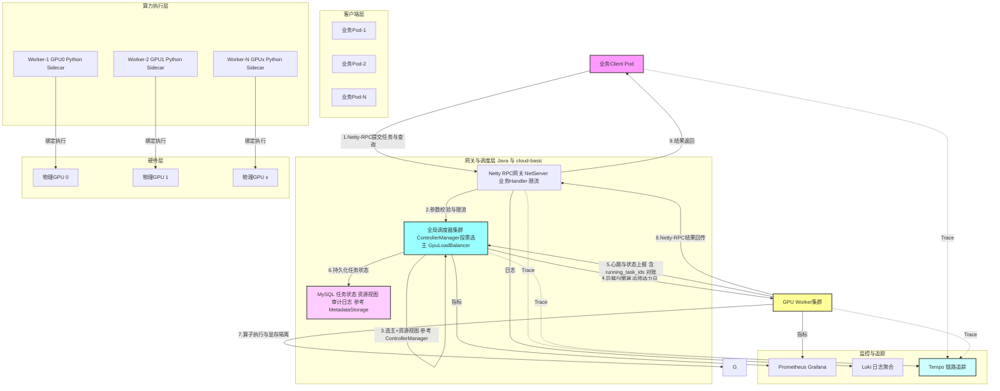

# GPU 统一资源池分布式调度服务技术方案（V2.1 增强版）

> 修订说明：本方案在原始 V2.0 基础上补充架构漏洞修复、状态机、故障矩阵、安全模型、容量规划、迁移路径等内容,目标是把"看起来合理"变成"可以落地"。文中标记 `⚠️` 的为新增的关键设计点,标记 `❓` 的为待决项。

---

## 0. 修订要点速览

| 类别 | V2.0 漏洞 | V2.1 修复 |
|---|---|---|
| 调度协调 | 多副本调度器无协调机制,可能双发 | 复用 `cloud-server` 的 `ControllerManager` 自研投票选主 + 任务分配幂等键(无需 Etcd) |
| Worker 发现 | 未明确 | Worker 通过 K8s Service / Nacos 注册,Scheduler 主动订阅 + 心跳维护 |
| 同节点亲和 | 用 pod IP 做匹配错误 | 用 Node IP,Client 通过 Downward API 注入 |
| 资源状态一致性 | 只提 Redis | 拆"权威状态"和"缓存视图":Redis 为权威,Scheduler 内存缓存为视图,基于版本号检测冲突 |
| 大张量传输 | Protobuf bytes 序列化大张量低效 | 区分 metadata(RPC)与 payload(直传);支持 **共享内存 / RDMA / NAS / 对象存储** 四档 out-of-band |
| GPU 内存隔离 | 仅声明"软隔离" | 区分 MIG(硬隔离)/ MPS(中隔离)/ 进程级 CUDA context(软隔离)三档,按业务等级选择 |
| Python Op 集成 | 未说明 | 三种模式:同进程 PyO3(低延迟)/ Sidecar gRPC(中)/ 子进程(隔离强),按 Op 类型选择 |
| 安全 | 未提 | mTLS + 业务 Token + Op 白名单 + 沙箱 |
| 观测 | 只提 Prometheus | 补 RED/USE 指标、OpenTelemetry 链路追踪、SLO/SLI |
| 冷启动 | 仅说预热 | 增加预热池保活、LRU 驱逐、空闲释放调度 |
| 迁移路径 | 未提 | 双跑 + 灰度切流 + 回滚预案 |
| MVP 范围 | 1-2 周偏激进 | 收窄到单 Op 单业务单集群,MVP 6 周更现实 |
| Worker↔GPU 关系(澄清) | 写死 1:1 单卡接管 | 抽象为 **N:M 灵活**,默认 1:1,LLM 跨卡 TP 场景启用 1:N;Scheduler 只看 `worker_id` 不看 `gpu_id`;Op 注册粒度 = Worker,通过 `WorkerConfig.managed_devices` 声明(详见 [§2.2.4](#224-gpu-资源执行层worker-集群) 与 [§12.6](#126-worker-启动配置协议v21-新增)) |

---

## 1. 方案概述

### 1.1 背景问题

Kubernetes 集群 GPU 资源采用**静态绑定 Pod** 的调度模式,即业务 Pod 启动时独占指定 GPU 卡资源,存在诸多资源浪费与调度短板:

- **资源碎片化严重**:部分业务 Pod 长期占用 GPU 但低负载、空跑,部分突发业务无 GPU 资源可申请,GPU 整体算力利用率极低;
- **资源隔离僵化**:GPU 粒度绑定业务,无法实现卡内算力、显存的精细化共享,小算子任务无法复用单卡冗余资源;
- **业务耦合度高**:业务容器必须集成 CUDA、推理框架等重型依赖,镜像体积大、启动慢,扩容依赖集群 GPU 配额;
- **无全局负载均衡**:原生调度仅实现节点级资源分配,无法基于 GPU 实时显存、算力负载、任务队列做动态调度。

### 1.2 方案目标

搭建一套**中心化 GPU 资源池分布式调度服务**,实现 GPU 资源全局池化、动态调度、负载均衡。业务 Pod 作为客户端仅负责业务逻辑,所有 GPU 算子计算任务统一提交至服务端资源池执行,核心目标如下:

- GPU 算力、显存资源全局统一管理,消除资源碎片,提升整体 GPU 利用率至 70% 以上;
- 解耦业务 Pod 与 GPU 硬件,业务容器轻量化,无需挂载 GPU 设备、无需集成 CUDA 运行时;
- 基于**现有成熟 SpringBoot+Netty+Protobuf 通用 Client-Server 通信组件**快速搭建算力通信链路,复用基础能力,实现算子级别的远程提交、执行、结果回传;
- 基于 GPU 实时负载的智能负载均衡、任务排队、资源隔离、异常自愈能力;
- 构建统一的 GPU 任务监控、限流、配额管理体系,保障多业务并发稳定运行。

### 1.3 核心设计理念

采用**Client-Server 分布式架构**,彻底颠覆 K8s 静态 GPU 绑定模式:

- Client 端:所有业务 Pod,无 GPU 权限、无 CUDA 依赖,仅提交「输入数据+算子 ID+任务参数」;
- Server 端:GPU 资源池服务集群,统一接管所有物理 GPU 资源,负责任务调度、算子执行、资源回收;
- 通信层:**复用现有自研 Netty+Protobuf 通用 RPC 组件**,无需从零开发通信底座,基于现有能力适配 GPU 张量传输、长连接管控、异步消息投递场景;
- 调度层:全局实时采集 GPU 负载,动态分配最优执行节点,实现算力最大化复用。

---

## 2. 总体系统架构

### 2.1 架构总图

系统分为四层,从上至下依次为:业务客户端层、RPC 通信网关层、全局调度管理层、GPU 资源执行层,完全解耦业务与算力资源。

**架构链路:业务 Pod(Client) → 自研 Netty-RPC 网关 → 全局调度器 → GPU Worker 节点 → 物理 GPU**

### 2.2 分层详细设计

### 2.2.1 客户端层(Client)

集群内所有 AI 业务、推理业务、流式计算业务 Pod 统一作为 GPU 服务客户端,核心特性:

- 无 GPU 设备挂载、无 CUDA/Torch/TensorRT 运行时依赖,镜像轻量化;
- 内置统一 Client SDK,封装 RPC 请求封装、重试、超时、异常处理、数据序列化;
- 仅负责数据预处理、业务逻辑编排、结果后处理,不参与任何 GPU 计算;
- 任务提交格式标准化:任务 ID、算子 ID、输入张量数据、资源需求、优先级、超时时间。

### 2.2.2 RPC 通信网关层

**完全复用业务现有 SpringBoot+Netty+Protobuf 通用 Client-Server 通信组件**作为底层通信底座,仅做业务适配与场景增强,代替开源 gRPC,统一所有客户端请求入口,深度适配 GPU 张量传输场景:

- 请求接入:统一接收 Client RPC 请求,实现协议解析、参数校验、权限校验、流量限流;
- 数据编解码:基于 Protobuf 实现张量、算子参数高效序列化/反序列化,结合 Netty 零拷贝 ByteBuf 优化传输,支持二进制无损传输;
- 连接管理:基于 Netty 实现长连接池、自定义心跳保活、断线重连、空闲连接回收,彻底规避连接泄露;
- 流量控制:支持单业务、单 Pod 请求配额,防止突发流量打爆 GPU 资源池;
- 路由转发:将任务请求转发至全局调度器,将 Worker 回传结果路由回 Client。

### 2.2.3 全局调度管理层(核心)

无状态中心化调度服务,是整个资源池的大脑,负责全局资源感知与任务分发,核心模块:

- **资源状态采集模块**:实时收集所有 GPU Worker 的显存占用、算力利用率、任务队列长度、卡温度、运行状态,构建全局 GPU 资源视图;
- **负载均衡调度模块**:基于多维度权重算法,动态选择最优 GPU 节点执行任务;
- **任务队列管理模块**:支持任务优先级排序、超时排队、任务熔断、重复任务去重;
- **资源配额模块**:按业务线配置 GPU 算力、显存、并发任务上限,实现多业务隔离;
- **⚠️ 调度协调模块(新增)**:多副本调度器通过借鉴 `cloud-server` 的 `ControllerManager` 自研投票机制选主 + 任务分配幂等键,避免脑裂双发(**不引入 Etcd**);
- **⚠️ 任务状态机(新增)**:维护任务从 PENDING → QUEUED → ASSIGNED → RUNNING → SUCCESS/FAILED/TIMEOUT/ORPHAN 全生命周期。

### 2.2.4 GPU 资源执行层(Worker 集群)

Worker 是算力执行载体,也是 **Scheduler 的最小调度单元**(Scheduler 只看 Worker,看不到物理 GPU 卡)。每个 Worker 进程在启动期声明它管理的 GPU 范围,并向 Scheduler 注册自己能跑的 Op 集合。核心能力:

- 算子注册与缓存:启动期预加载所有声明的 Op 与模型权重,常驻内存缓存,避免重复加载开销;
- 任务执行引擎:接收调度器分发的任务,根据内部 GPU 拓扑选卡执行算子计算;
- 资源隔离与回收:单任务显存限额、任务超时强制终止、断连资源自动回收,防止显存泄露与 OOM 雪崩;
- 状态上报:实时上报自身负载(聚合所有 managed GPU)、任务执行状态、异常信息至调度中心;
- **⚠️ GPU 共享模式(新增)**:支持 MIG(硬件硬隔离)/ MPS(中隔离)/ 单进程独占(软隔离)三种模式,按业务等级配置;
- **⚠️ Worker ↔ GPU 关系可配置(V2.1 澄清)**:见下表。

#### ⚠️ Worker ↔ GPU ↔ Op 关系表(V2.1 澄清)

| 层级关系 | 默认配置 | 何时打破默认 | 打破后的影响 |
|---|---|---|---|
| **物理 GPU 卡 ↔ Worker 进程** | **1:1**(故障隔离清晰) | 1:N — LLM 70B+ 跨卡 Tensor Parallel 场景 | 单 Worker 故障影响 N 张卡;但能跑大模型 |
| **MIG instance ↔ Worker 进程** | **1:1**(H100 一张卡切成 7 个 MIG → 7 个 Worker) | 不建议合并,MIG 本身即隔离边界 | — |
| **Op ↔ Worker** | **多对多**(每个 Worker 启动期从 application.yml 加载自己支持的 Op 列表) | 不存在"Op 不在 Worker 上还能跑"的情况 | — |

**核心原则**:

1. **Scheduler 只看 Worker** — 调度单元是 `worker_id`,不是 `gpu_id`。Scheduler 选 Worker,Worker 内部用 `CUDA_VISIBLE_DEVICES` 选物理卡。
2. **Worker 自治** — Worker 知道自己的卡拓扑(NVLink / PCIe / 跨节点),可以做"同卡 > 同节点 > 跨节点"的二次任务分配,Scheduler 无需感知。
3. **演进平滑** — 从 1:1 演进到 1:N,Scheduler 端**零改动**,只改 Worker 的 `application.yml`。

**MVP 阶段**(≤ 3 节点,1 个 text_classification Op):1:1 即可,3 个 Worker 进程,每 Worker 绑定一张物理卡。

```yaml
# application.yml of Worker (MVP 配置示例)
gpu:
  managed_devices:
    - gpu_id: "gpu-0"
      isolation: "soft"
      mem_total_mb: 81920
      compute_cap: "9.0"
ops:
  - op_id: text_classification
    version: v1
    min_gpu_mem_mb: 4096
    require_compute_cap: ">=7.5"
```

**未来扩展(LLM 大模型场景)**:

```yaml
# 1:N 模式 — 单 Worker 管 4 卡跑 TP-4
gpu:
  managed_devices:
    - gpu_id: "gpu-0"
    - gpu_id: "gpu-1"
    - gpu_id: "gpu-2"
    - gpu_id: "gpu-3"
  topology_hint: "nvlink-domain"
ops:
  - op_id: llm_qwen70b
    version: v1
    min_gpu_mem_mb: 80000     # 跨 4 卡共 80GB+
    require_min_gpus: 4
```

详细 Protobuf 字段定义与注册流程见 [§12.6](#126-worker-启动配置协议v21-新增)。

---

## 3. 核心通信协议设计(自研 RPC)

### 3.1 协议设计原则

- 拒绝动态函数下发,规避序列化安全问题与版本兼容问题,采用**算子 ID 注册制**;
- 区分小数据高频请求、大数据批量请求,适配不同场景性能需求;
- 协议轻量化、可扩展,支持后续新增算子、新增资源调度维度;
- **⚠️ Metadata/Payload 分离(新增)**:RPC 帧只传元数据,大张量走 out-of-band 直传通道。

### 3.2 RPC 请求结构体(核心字段)

```json
{
  "task_id": "唯一任务UUID",
  "op_id": "预注册算子唯一标识",
  "op_params": "算子超参JSON",
  "input_data_ref": "输入数据引用(对象存储 key / NAS 文件路径 / 共享内存 token / RDMA 句柄)",
  "input_data_inline": "小数据场景内联bytes(<256KB)",
  "priority": "1-10(优先级)",
  "gpu_mem_limit": "单任务最大显存占用Byte",
  "timeout": "任务超时时间ms",
  "biz_code": "业务线标识",
  "idempotency_key": "幂等键(用于重试去重)",
  "client_node_ip": "客户端所在Node IP(同节点亲和,经Downward API注入)"
}
```

### 3.3 RPC 响应结构体

```json
{
  "task_id": "唯一任务UUID",
  "code": "0成功/非0异常码",
  "msg": "执行信息",
  "output_data_ref": "输出数据引用(可零拷贝获取)",
  "output_data_inline": "小结果内联",
  "cost_time": "执行耗时ms",
  "gpu_device_id": "执行GPU卡号",
  "worker_id": "执行Worker ID",
  "retry_recommended": "是否建议重试"
}
```

### 3.4 特殊通信优化策略

- **大张量 out-of-band 直传(增强,四档传输)**:超过 256KB 的张量数据**不直接走 RPC 帧**,根据场景选择最匹配的一档:
  - **共享内存(同节点,优先级最高)**:同节点 Client/Worker 间通过 `shm_open` 创建共享内存,传递 fd + token,RPC 帧只传 token,Worker `mmap` 直接读,实现零拷贝;延迟 < 1ms;
  - **RDMA(同集群低延迟,优先级次高)**:集群支持 RoCE 时,客户端通过 `ibv_reg_mr` 注册内存,Worker 端 `ibv_post_recv` 拉取,RPC 帧传 rkey + addr + len;延迟 1-3ms,kernel bypass;
  - **NAS(同集群文件级共享,NFS/SMB 协议)**:跨节点但未部署 RDMA,或 NAS 已是企业标准设施时,通过 NFS v4.1/SMB3 直接挂载目录(/mnt/nas/gpu-payload/),Client 写入文件,Worker 直接 `fopen` + `mmap` 或 `read`;延迟 5-20ms,适合 10MB-1GB 中等张量;
  - **对象存储(跨可用区或超大张量,>1GB)**:跨可用区或超大张量场景,Client 写入 S3/MinIO,Worker 流式读取(`GetObject` + 分块下载);延迟 50-500ms,适合容灾与冷数据;

- **⚠️ 产品到档位的映射表(常见存储归位)**:四档 out-of-band 按**协议/语义**划分,不按产品名;同一产品可能因访问协议不同落不同档:

  | 产品/系统 | 访问协议 | 落档 | 备注 |
  |---|---|---|---|
  | CephFS | POSIX mount(`ceph-fuse`/`krbd`) | NAS | 文件级,语义对齐 NAS |
  | Ceph RGW | S3-compatible HTTP | 对象存储 | 暴露 S3 接口,语义对齐对象存储 |
  | Ceph RBD | kernel block device | ❌ 不适用 | 块设备,GPU 张量场景不直接用 |
  | JuiceFS | FUSE POSIX mount(`juicefs mount`) | NAS | FUSE 文件级,数据后端走 S3/OSS 等对象存储 |
  | Lustre / BeeGFS / GPFS / WekaFS / 华为 OceanFS | POSIX mount(并行文件系统) | NAS(高性能子档) | HPC 标配,带宽 10-100 GB/s,延迟 < 5ms,实际介于 NAS 与 RDMA 之间 |
  | MinIO | S3 API | 对象存储 | 自建 S3 |
  | AWS S3 / 阿里 OSS / 腾讯 COS / 华为 OBS | S3 API | 对象存储 | 公有云对象存储 |
  | NetApp / Isilon(PowerScale)/ Pure FlashBlade / 华为 OceanStor | NFS/SMB | NAS | 传统企业 NAS |
  | Alluxio / 阿里 Jindofs | POSIX FUSE + 本地 SSD 缓存 | NAS(智能缓存子档) | 元数据缓存 + 数据本地 SSD 缓存,命中后亚毫秒 |
  | GlusterFS | POSIX mount | NAS | 文件级 |

- **选型决策树**:

  ```
  Client 提交 task + tensor payload
      │
      ├── 1. payload < 256KB ?
      │     → DATA_INLINE (内联 RPC 帧)
      │
      ├── 2. Client 与 Worker 同节点 ?
      │     → DATA_SHARED_MEM (共享内存,< 1ms)
      │
      ├── 3. 集群已部署 RDMA / RoCE ?
      │     → DATA_RDMA (1-3ms,kernel bypass)
      │
      ├── 4. 集群已部署 NFS / SMB / CephFS / JuiceFS / Lustre ?
      │     → DATA_NAS (5-20ms,POSIX 直读)
      │     └─ 若有 Alluxio / Jindofs 缓存层 → 命中本地 SSD 缓存(亚毫秒)
      │
      └── 5. 跨可用区 / 超大张量 / 冷数据 ?
            → DATA_OBJECT_STORE (50-500ms,Client 写入 S3/OSS,Worker 流式拉取)
  ```

- **JuiceFS / Alluxio 实战提示**:
  - JuiceFS 的元数据走 Redis/TiKV,数据走对象存储,FUSE 客户端对 Worker 表现为本地挂载目录;在 GPU 场景,Client 先 `juicefs mount` 共享训练数据集,Worker 也 `juicefs mount`,任务直接读 `/mnt/juicefs/dataset/...`,无需任何 RPC 协调;
  - Alluxio 通过在每个 GPU 节点缓存热数据,把 S3 后端的延迟从 50-500ms 降到亚毫秒,适合"训练数据集大但每轮只读一批"的场景;
  - 这两种系统让 NAS 档在延迟上接近 RDMA 档,但保留了 POSIX 兼容性,实际工程中性价比最高。
  - 阈值动态可配:默认 256KB,可在网关配置中心调整;
- **同节点亲和调度**:Client Pod 通过 K8s Downward API 将所在 Node IP 注入环境变量,提交任务时携带 `client_node_ip`,调度器优先派发至同 Node 上的 Worker,降低跨节点网络延迟;
- **同节点共享内存通信**:同节点任务启用共享内存直传,代替 TCP 通信;
- **小任务批量合并**:对高频轻量算子任务做批量合并执行,减少 RPC 交互开销;
- **⚠️ 流式响应(新增)**:对超长推理/生成类任务,采用 Server-Sent Events 或分块流式回传,避免单 RPC 帧超大。

---

## 4. 调度策略设计(核心能力)

### 4.1 多维度负载均衡算法

调度器基于综合负载分数选择最优 GPU 节点,分数越低负载越优,优先分发任务,权重公式:

**节点综合分数 = 显存占用率×0.5 + 算力利用率×0.3 + 队列任务数归一化×0.2**

调度优先级规则:

1. 优先筛选满足任务显存最低需求的 GPU 节点;
2. 同资源条件下,选择综合分数最低的空闲节点;
3. 高优先级任务插队执行,低优先级任务排队等待;
4. 自动规避异常节点、高负载瓶颈节点;
5. **⚠️ 二级调度:同节点亲和 > 跨节点就近(Node 拓扑距离) > 随机(新增)**。

### 4.2 任务队列机制

- 分级队列:分为高、中、低三级优先级队列,独立排队、独立调度;
- 队列限流:单 Worker 最大排队任务数上限,超出后触发熔断,返回客户端繁忙;
- 超时清理:排队超时、执行超时任务自动终止,释放 GPU 资源,返回超时异常;
- **⚠️ 抢占机制(新增)**:高优先级任务到达时,可配置是否抢占低优先级任务,抢占后低优先级任务重新入队。

### 4.3 资源隔离与自愈机制

- **显存软隔离**:每个任务配置独立显存上限,超出上限直接终止任务,避免单任务 OOM 影响整卡;
- **断连资源回收**:客户端异常断开、RPC 连接中断时,Worker 自动终止对应任务、释放显存;
- **节点自愈**:Worker 卡死、GPU 异常时,调度器自动剔除故障节点,任务重新分发至正常节点;
- **空闲资源释放**:长时间空闲的算子缓存、临时显存自动回收,最大化释放资源;
- **⚠️ 显存硬隔离(增强)**:按业务等级选择 GPU 共享模式 ——
  - **高隔离业务**(金融、医影像等):MIG 硬分片,1 张 A100 切 7 个 MIG 实例,每实例独立显存、算力、编解码器;
  - **中隔离业务**:MPS 多进程服务,共享 GPU 上下文但独立显存配额;
  - **低隔离业务**(内部测试、离线任务):单进程独占,依赖 cgroups + CUDA context 显存硬限。

### 4.4 ⚠️ 分布式调度协调(基于现有 ControllerManager 机制改造)

多副本调度器面临的核心问题是**脑裂双发**:Scheduler-A 选好 Worker 并下发任务,Scheduler-B 同时也选中同一 Worker 派发任务,导致 Worker 资源被双重占用。

**重要决策**:不引入 Etcd/Redis,**直接复用 cloud-server 的 `ControllerManager` 自研投票选举机制**(见 `cloud-server/src/main/java/com/xx/cloud/server/shard/controller/ControllerManager.java`),它已经实现了成熟的多轮投票 + 强制选票 + 脑裂防护。结合任务分配幂等做双层防御:

1. **选主(避免同时调度)**:多 Scheduler 副本启动时通过 `ControllerManager.startControllerElection()` 投票选举,主节点负责调度决策,备节点仅做热备待命;主节点故障时备节点通过投票抢占成为新主;参考现有实现,双主窗口控制在 3 秒以内;
2. **脑裂防护**:借鉴 `ControllerManager.onReceiveSlots()` 的处理逻辑——收到非本集群 Controller 的 slots 推送时,主动发送 `RESET_CONTROLLER` 强制选票让对方承认新 Controller;
3. **任务分配幂等(防止双发)**:每个任务分配请求携带 `idempotency_key`(通常 = task_id),Worker 端用 `(idempotency_key, worker_id)` 做去重键(可基于现有 `RequestPromise.promiseMap` 模式),重复请求直接返回已存在任务的执行状态;
4. **资源预留乐观锁**:Scheduler 派发前在本地内存(借鉴 `slotNodeMap` 模式)+ MySQL 持久层(借鉴 `metadataStorage`)原子地"扣减"Worker 的可用资源配额:
   ```java
   // 伪代码:基于 ConcurrentHashMap 的原子操作
   synchronized (workerQuotaLock) {
       if (worker.availMem >= needMem && worker.queueNum < maxQueue) {
           worker.availMem -= needMem;
           worker.queueNum += 1;
           taskAssignment.put(taskId, workerId);
           return true;
       }
       return false;
   }
   ```
   失败则选下一节点,避免本地内存计算与实际状态不一致;定期将 workerQuota 异步刷 MySQL 持久化;
5. **Worker 心跳校验**:Worker 周期性上报 `running_task_ids`,Scheduler 对账发现不匹配任务即标记 ORPHAN 并清理(借鉴 `ControllerManager.onReceiveHeartbeat` 思路)。

### 4.5 ⚠️ 任务状态机(新增)

| 状态 | 触发条件 | 下一可能状态 |
|---|---|---|
| PENDING | Client 提交,等待参数校验 | QUEUED / FAILED(校验失败) |
| QUEUED | 已入队列,等待 Worker | ASSIGNED / CANCELLED / TIMEOUT(排队超时) |
| ASSIGNED | Scheduler 已派发到 Worker | RUNNING / ORPHAN(Worker 失败) |
| RUNNING | Worker 开始执行 | SUCCESS / FAILED / TIMEOUT / ORPHAN |
| SUCCESS | Worker 返回成功 | 终态 |
| FAILED | 执行异常 | 终态 |
| TIMEOUT | 执行超时 | 终态 |
| CANCELLED | Client 主动取消 | 终态 |
| ORPHAN | Worker 失联/重启,任务丢失 | 重新 ASSIGNED 或 FAILED |

所有状态变更写 Redis Stream + 本地缓存,供 Client 端查询与对账使用。

---

## 5. 核心模块详细设计

### 5.1 算子注册中心

为解决远程函数执行的兼容性、安全性问题,系统采用**静态算子注册机制**,禁止动态代码下发:

- 服务端统一注册所有业务算子(卷积、特征提取、推理、解码等),分配唯一 OP ID;
- 算子支持版本管理,可灰度更新、旧版本兼容保留;
- 客户端仅通过 OP ID 调用算子,无需感知算子底层实现;
- 支持模型常驻 GPU 缓存,预热加载高频算子,提升任务响应速度;
- **⚠️ 算子签名版本化(增强)**:Op 定义包含入参 schema 版本号,Worker 校验请求 schema 与本地缓存版本一致,不一致拒绝执行并要求 Client 升级;
- **⚠️ 算子沙箱(增强)**:算子执行限定在独立 CUDA context / 子进程内,异常不影响 Worker 主进程。

### 5.2 客户端 SDK 模块

统一封装业务调用能力,屏蔽底层 RPC、调度细节,提供极简调用接口:

- 基础接口:任务提交、同步/异步查询结果、任务取消;
- 容错能力:自动重试、超时兜底、熔断降级;
- 监控埋点:自动统计调用耗时、成功率、异常率,上报监控系统;
- 配置热更新:支持服务端地址、超时时间、限流阈值动态更新;
- **⚠️ 故障注入开关(新增)**:SDK 集成 Chaos 故障注入,用于演练 Gateway 抖动、调度超时等场景。

### 5.3 监控告警模块

全覆盖监控 GPU 资源与任务运行状态,保障系统稳定性:

- 资源指标:GPU 显存利用率、算力利用率、温度、显存泄露量;
- 任务指标:任务吞吐、成功率、平均耗时、排队时长、超时率;
- 业务指标:各业务线 GPU 占用量、任务并发数、资源使用率;
- 告警规则:GPU 高负载、任务失败突增、节点离线、显存泄露、队列堆积告警;
- **⚠️ 核心 SLI/SLO 定义(新增)**:
  - 任务提交成功率 SLI:成功提交 / 总提交 ≥ 99.9%(月度)
  - 任务 P99 执行耗时 SLI:较基线劣化 ≤ 20%
  - 任务超时率 SLI:< 0.5%
  - 资源利用率 SLI:整体 GPU 利用率 ≥ 60% 持续 24h
- **⚠️ 链路追踪(新增)**:全链路 OpenTelemetry Trace,Client → Gateway → Scheduler → Worker,关键 span 注入 trace_id,日志关联 trace_id 便于排障。

### 5.4 ⚠️ 安全模型(新增)

| 维度 | 措施 |
|---|---|
| 传输加密 | Gateway ↔ Worker、Gateway ↔ Client 全部启用 mTLS,证书通过 K8s Secret + cert-manager 自动轮转 |
| 认证 | Client 携带业务 Token(HS256),Gateway 校验后路由;Token 与 biz_code 绑定,防越权 |
| 鉴权 | RBAC:每个 biz_code 仅能提交预注册算子,禁止越权调用;Worker 仅接受白名单 Scheduler 下发的任务 |
| Op 沙箱 | 算子在独立子进程/CUDA context 中执行,异常崩溃仅影响单个任务,Worker 主进程不退出 |
| 审计 | 所有任务执行记录写入审计日志,含 trace_id / biz_code / op_id / 执行者,留存 90 天 |
| 输入校验 | Protobuf 字段长度限制、JSON 深度限制,防 DoS |

---

## 6. 部署架构与环境适配

### 6.1 部署模式(K8s 集群)

- **调度器**:⚠️ 多副本 Deployment(2-3 副本),基于借鉴 `cloud-server` 的 `ControllerManager` 投票选主,不占用 GPU 资源;
- **RPC 网关**:无状态 Deployment 部署,水平扩容应对高并发请求;
- **GPU Worker**:DaemonSet 部署,每个 GPU 节点启动一个或多个 Worker Pod;**默认每 Pod 独占 1 张物理 GPU 卡**(MVP 配置),通过 `WorkerConfig.managed_devices` 声明;LLM 大模型场景下 1 Pod 可管 N 张卡(详见 [§2.2.4](#224-gpu-资源执行层worker-集群));
- **客户端**:原有业务 Pod 无需改造,仅引入 SDK 即可接入;
- **⚠️ 配套中间件**:MySQL(任务状态/算子清单/审计日志,借鉴 cloud 的 `MetadataStorage` 模式)、Nacos(服务发现/动态配置,可选用 Apollo)、Prometheus + Grafana + Loki + Tempo(监控/日志/链路)。**不引入 Etcd / Redis Cluster**(选主复用 ControllerManager,状态走 MySQL)。

### 6.2 高可用保障

- 调度器、网关多副本部署,支持故障自动切换,无单点故障;
- Worker 节点故障自动剔除,任务自动重试分发;
- 支持 GPU 节点动态扩缩容,不影响业务运行;
- 核心数据、任务状态持久化存储,避免重启丢失数据;
- **⚠️ MySQL 高可用(增强,替换原 Redis Cluster 方案)**:MGR(Group Replication)三节点或主从半同步 + MHA,任务状态表按 task_id 分库分表(参考 cloud-platform 的 admin 表设计),冷数据归档到 OSS;
- **⚠️ 灾备演练(增强)**:每季度模拟主调度器崩溃、Worker 节点故障、Redis 主从切换等场景,验证恢复时间 ≤ 5 分钟。

### 6.3 ⚠️ GPU 节点拓扑感知(新增)

调度时优先考虑 GPU 拓扑:

- 同节点 NVLink/PCIe 直连 > 同 ToR 交换机跨节点 > 跨交换机;
- 通过 `nvidia-smi topo -m` 预生成节点拓扑表,Scheduler 内存缓存;
- 多卡任务(模型并行)优先调度拓扑互联最优的 Worker 组合。

---

## 7. ⚠️ 落地实施步骤(MVP 到生产)

### 7.1 第一阶段:MVP 最小验证(6 周)

> **范围收窄**:仅支持 1 个推理类 Op、1 个业务线、单集群、≤ 3 个 GPU 节点。验证端到端可行性,不做性能优化。

**第 1-2 周:基础通信与算子注册**

1. 基于现有 Netty+Protobuf 通用通信组件,扩展 GPU 算力调度业务协议(gpu.pool.v1);
2. 实现 Worker 端算子静态注册机制(配置中心下发算子清单);
3. Client SDK 封装 submit/query/cancel 三个核心方法;
4. 单元测试覆盖编解码、心跳、重连。

**第 3-4 周:调度与任务执行**

5. Scheduler 单实例版(暂不做分布式协调):Redis 资源状态、心跳接收、负载均衡算法落地;
6. Worker 端任务执行引擎:Python Op 通过 gRPC Sidecar 调用,Rust 主进程管任务调度;
7. 端到端联调:1 个推理业务接入,验证任务提交→调度→执行→结果回传全链路。

**第 5-6 周:故障注入与可观测**

8. 故障场景演练:Worker 崩溃重连、任务超时、Redis 抖动;
9. Prometheus 基础指标埋点 + Grafana Dashboard;
10. 运维手册初版 + 故障 Runbook。

### 7.2 第二阶段:能力完善(4 周)

1. 多副本调度器 + 借鉴 `ControllerManager` 投票选主 + 任务幂等键(防止双发);
2. 优先级抢占 + 同节点亲和 + 节点拓扑感知;
3. 显存硬隔离(MPS 模式)、任务超时强终止;
4. 大张量 out-of-band 传输(共享内存 + 对象存储);
5. OpenTelemetry 全链路追踪集成;
6. 多业务线接入(扩展至 3-5 个 Op)。

### 7.3 第三阶段:生产可用(4 周)

1. 多集群部署 + 跨可用区容灾演练;
2. 全量业务算子接入,灰度切流(双跑 1 周 → 50% 切流 → 100%);
3. 性能压测:单 Gateway ≥ 5 万 QPS,单 Scheduler ≥ 1 万任务/秒调度决策;
4. 安全加固:mTLS、RBAC、审计日志;
5. 自动化运维:基于 KEDA 的 Worker HPA、自动故障切换;
6. 输出运维手册、接入文档、故障处理预案。

### 7.4 ⚠️ 迁移路径(新增)

| 阶段 | 动作 | 风险控制 |
|---|---|---|
| 准备 | 业务 Pod 引入 Client SDK,但仍保留 K8s 静态 GPU 申请 | 双跑 |
| 灰度 | 选定 1 个非关键业务(如离线批处理),切流到新资源池 | 保留回滚开关 |
| 验证 | 对比新旧链路结果一致性、稳定性 2 周 | 自动化对账 |
| 扩量 | 按业务优先级分批切流,关键业务最后切 | 每批观察 1 周 |
| 下线 | 全部切流后,回收静态 GPU 配额 | 保留 2 周回滚窗口 |

---

## 8. 风险点与优化方案

### 8.1 网络延迟风险

**问题**:细粒度算子 RPC 交互频繁,网络延迟可能高于本地执行。

**优化**:

- 同节点共享内存通信 + 小任务批量合并 + 算子预缓存 + 就近调度;
- **⚠️ 关键路径 gRPC 替代**:Worker 与 Gateway 同步链路用 Netty RPC,Python Op Sidecar 调用用 gRPC(生态成熟)。

### 8.2 GPU OOM 与资源冲突风险

**问题**:多任务共享单卡,易出现显存溢出、任务互相影响。

**优化**:

- 单任务显存限额 + 任务超时强制回收 + 优先级隔离 + 异常任务快速剔除;
- **⚠️ OOM 前瞻预测(增强)**:基于历史执行峰值 × 安全系数(1.5x) 预估 task_mem_limit,不达标直接拒绝入队,避免运行时 OOM。

### 8.3 系统复杂度提升风险

**问题**:新增调度、RPC、Worker 组件,运维复杂度高于原生 K8s 调度。

**优化**:

- 组件轻量化部署 + 全链路监控 + 自动化自愈 + 标准化接入流程;
- **⚠️ 渐进式交付(增强)**:任何变更必须先在预发环境演练,通过 Chaos 测试后再上生产。

### 8.4 兼容性风险

**问题**:新旧业务、新旧算子版本兼容问题。

**优化**:

- 算子版本管理 + 灰度发布 + 新旧逻辑并行兼容;
- **⚠️ API 严格版本化(增强)**:Proto 文件版本 v1 → v2 时,旧版本至少保留 6 个月过渡期。

### 8.5 ⚠️ 冷启动风险(新增)

**问题**:大模型 Op 首次加载耗时 30s+,高频任务延迟劣化。

**优化**:

- **预热池**:Worker 启动时根据配置预加载 Top-N 高频 Op,常驻 GPU;
- **LRU 缓存**:不常驻的 Op 按需加载,空闲 30min 后驱逐释放显存;
- **加载并行**:Worker 启动期加载与心跳上报并行,加载完才声明 AVAILABLE,避免半态接任务。

### 8.6 ⚠️ Python Op 集成开销(新增)

**问题**:Worker(Rust) 调用 Python Op 每次跨语言边界有序列化与进程切换开销。

**优化** — 三种模式按场景选择:

| 模式 | 适用 | 实现 | 延迟 |
|---|---|---|---|
| 同进程 PyO3 | 极低延迟小算子 | Rust 嵌入 CPython 解释器,直接调用 | < 0.1ms |
| Sidecar gRPC | 中等延迟通用算子 | Python 独立进程,gRPC 服务,Rust 客户端 | 1-5ms |
| 子进程 stdin/stdout | 隔离最强慢算子 | Python 子进程,JSON over pipe | 10-50ms |

---

## 9. ⚠️ 容量规划(新增)

| 组件 | 估算方法 | MVP 规格 | 生产规格 |
|---|---|---|---|
| Gateway | 单实例 ~1 万 QPS,长连接 ~5 万/实例 | 2 副本 | 10 副本,Nginx LB |
| Scheduler | 调度决策 ~0.5ms/次,单实例 ~2 万任务/秒 | 1 主 1 备 | 3 主 3 备,借鉴 `ControllerManager` 投票选主 |
| Worker | 单卡最大并发任务 = 显存 / 单任务峰值 × 利用率(典型 4-8) | 3 Worker | 50+ Worker |
| MySQL | 每任务状态 ~500B,QPS = 任务 QPS × 3(提交/查询/状态变更) | 单 Master | MGR 三节点或主从 + MHA |
| 算子注册中心 | 静态配置 + MySQL 持久化,启动时全量加载到内存 | 单实例内嵌 | 独立服务 + 配置中心热更新 |
| 监控(Prometheus) | 每个组件 200-500 个指标,15s 抓取间隔 | 单实例 | 集群 + 远程存储 |

**集群规模上限经验值**:单 Scheduler 主节点可调度 ~1000 GPU 卡规模,超过则需分集群联邦。

---

## 10. ⚠️ 性能基线与压测计划(新增)

| 指标 | 基线目标 | 压测方法 |
|---|---|---|
| 任务提交 P99 延迟 | < 50ms | wrk/k6 模拟 5 万 QPS 提交 |
| 任务调度决策 P99 | < 10ms | 模拟 1000 节点,持续派发 |
| 单 Worker 任务吞吐 | 100 任务/秒(轻推理) | 业务真实负载回放 |
| GPU 利用率提升 | 从 30% → 70% | 对比迁移前后一周均值 |
| RPC 长连接数 | 单 Gateway 5 万连接 | 模拟 5 万 Client 持续保活 |

---

## 11. 方案价值总结

- **资源利用率提升**:彻底解决 GPU 静态绑定导致的资源碎片,实现算力精细化复用;
- **业务架构轻量化**:业务 Pod 彻底剥离 GPU 依赖,扩容灵活、启动快速、运维简单;
- **算力统一管控**:全局调度、负载均衡、权限配额、监控告警统一落地,实现 GPU 资源平台化管理;
- **扩展性极强**:支持 GPU 节点横向扩容、算子快速迭代、多业务无缝接入,适配未来算力扩容需求。

---

## 12. 核心落地补充规范(协议/架构图/技术栈/算法)

## 12.0 现有 ru yuan-cloud 通信基础设施盘点(必读)

> 关键发现:[/Users/lineng/Documents/javaCode/cloud](file:///Users/lineng/Documents/javaCode/cloud) 项目**已经实现了完整的分布式协调基础设施**,包括 Netty 通信 + 自研 Controller 选举 + Slot 路由,本方案应最大化复用,而非另起炉灶引入 Etcd 等外部组件。

### 12.0.1 现有 cloud-basic 模块提供的 Netty 组件

| 类 | 文件 | 能力 | 在 GPU 方案中的角色 |
|---|---|---|---|
| `NettyPacket` | `network/NettyPacket.java` | 私有协议包,Header 为 Protobuf `map<string,string>` 灵活 KV,Body 为 `byte[]` 业务 Protobuf | **通信载体**,直接复用 |
| `NettyPacketHeader` | `proto/network.proto` | `map<string, string> headers` | 协议头,GPU 业务字段直接写 KV |
| `NettyPacketEncoder` | `network/NettyPacketEncoder.java` | `MessageToByteEncoder<NettyPacket>`,池化 ByteBuf | **直接复用** |
| `NettyPacketDecoder` | `network/NettyPacketDecoder.java` | `LengthFieldBasedFrameDecoder(10MB, 3字节长度)` | **直接复用** |
| `BaseChannelInitializer` | `network/BaseChannelInitializer.java` | Pipeline 装配:Decoder + Prepender + Encoder + 业务 Handler | **直接复用** |
| `NetServer` | `network/NetServer.java` | 服务端,Epoll/NIO 切换,PooledByteBufAllocator,自定义 Handler 注入 | **Gateway / Worker 服务端直接用** |
| `NetClient` | `network/NetClient.java` | 客户端,自动重连(retryTime=-1 无限重试),连接监听,同步/异步发送 | **Client SDK / Worker 客户端直接用** |
| `RequestSupport` | `network/RequestSupport.java` | 请求-响应关联(基于 sequence),独立发送线程 + BlockingQueue,定时超时检测 | **直接复用** |
| `RequestPromise` | `network/RequestPromise.java` | 同步等待结果,支持 chunked 合并,自动 markTimeout | **直接复用** |
| `RequestWrapper` | `network/RequestWrapper.java` | 服务端响应工具,自动 chunked 拆分,`sendResponse(MessageLite)` 直接接 Protobuf | **直接复用** |
| `AbstractChannelHandler` | `network/AbstractChannelHandler.java` | 业务 Handler 基类,自动注入 MDC logger_id,可指定 `interestPackageTypes()`,可指定异步 Executor | **直接继承** |
| `DefaultChannelHandler` | `network/DefaultChannelHandler.java` | 默认 Handler,集成了 RequestSupport,处理响应包 + 推送包分发 | **直接复用** |
| `DefaultScheduler` | `network/DefaultScheduler.java` | ScheduledThreadPoolExecutor 封装,支持周期/单次/延迟调度,自动 MDC | **直接复用** |
| `PacketType` 枚举 | `network/enums/PacketType.java` | 已定义 12 种业务包类型(投票/心跳/订阅/元数据变更等) | **新增 GPU 业务 PacketType 值(从 100+ 起避免冲突)** |

### 12.0.2 现有 cloud-server 提供的分布式协调能力

| 类 | 文件 | 能力 | 在 GPU 方案中的复用方式 |
|---|---|---|---|
| `ControllerManager` | `server/shard/controller/ControllerManager.java` | **自研投票选举 Controller**,多轮投票 + `force=true` 强制选票 + 脑裂防护 | **直接借鉴选主流程,无需 Etcd** |
| `AbstractController` | `server/shard/controller/AbstractController.java` | Controller 抽象类,Slot 路由,元数据管理 | **借鉴 Slot 路由思路,GPU 调度新增专用 Controller** |
| `PeerNodes` / `PeerNode` | `server/shard/peer/` | 集群节点拓扑管理,broadcast / send by nodeId | **Scheduler ↔ Scheduler 通信复用** |
| `ClientChannelHandler` / `ShardChannelHandler` | `server/shard/` | 服务端业务 Handler 链 | **GPU 业务 Handler 借鉴其分层设计** |
| `MetadataStorage` | `server/store/` | 元数据 MySQL 持久化 | **任务状态可复用持久化模式** |

### 12.0.3 关键复用决策(避免重复造轮子)

| 决策项 | 原 V2.1 方案 | 修正方案 | 理由 |
|---|---|---|---|
| 选主组件 | Etcd | **复用 `ControllerManager` 自研投票机制** | 已实现 5 节点投票选举 + 强制选票 + 脑裂防护,无需引入外部组件 |
| 路由分发 | 自研 Redis Lua | **复用 Slot 计算思路(`slotFor(key)` 哈希到 NodeId)** | 已实现 16384 槽位,Slot 路由天然适合"按 key 选 Worker" |
| 状态存储 | Redis Cluster | 复用 `MetadataStorage` MySQL 模式 + 内存缓存 | 任务状态、Worker 状态可直接落 MySQL,降低运维复杂度 |
| 协议帧 | 自定义 magic + version | **直接用 `NettyPacket` 框架** | Header 用 `map<string,string>`,业务字段直接 KV 扩展 |
| 服务发现 | Nacos | **复用 `PeerNodes` 集群拓扑** | Server ↔ Server、Client ↔ Gateway 都用现成的 NetClient/NetServer |
| 流量控制 | Sentinel | **自行基于 `NettyPacket.header` 扩展 count 字段** | Header 灵活性天然支持 |

### 12.0.4 复用示例:Client SDK 提交任务的核心 6 行代码

```java
// 业务 Client SDK 提交 GPU 任务 — 完全基于现有 cloud-basic 组件
public class GpuTaskClient {
    private final NetClient netClient; // 复用 ru yuan-cloud-basic 的 NetClient

    public GpuSubmitResponse submitTask(SubmitTaskRequest req) throws Exception {
        // 1. 业务 Protobuf 序列化
        byte[] body = req.toByteArray();

        // 2. 复用 NettyPacket.buildPacket
        NettyPacket packet = NettyPacket.buildPacket(body, PacketType.GPU_SUBMIT_TASK);

        // 3. Header 扩展 GPU 业务字段(利用 map<string,string> 灵活性)
        packet.setTimeoutInMs(req.getTimeoutMs());
        packet.setSequence(UUID.randomUUID().toString());

        // 4. 复用 NetClient 同步发送(底层走 RequestPromise + 异步发送线程)
        NettyPacket response = netClient.sendSync(packet);

        // 5. 业务 Protobuf 反序列化
        return SubmitTaskResponse.parseFrom(response.getBody());
    }
}
```

### 12.1 Protobuf 协议适配(基于现有 Netty 通信组件扩展)

**协议结构沿用 `NettyPacket` 既有格式**(Header 为 Protobuf `map<string,string>`,Body 为 `byte[]`):

```
+--------+---------+--------+---------+----------------+
| 4字节   | Header   | 4字节   | Body     |  业务 Protobuf |
| Header | 序列化   | Body   | 长度    |  内容          |
| Length | bytes   | Length |         |                |
+--------+---------+--------+---------+----------------+
   ↑                ↑         ↑                ↑
   由 NettyPacketDecoder 解析    业务 Protobuf
   (3字节 LengthFieldPrepender)
```

Header 中复用现有 KV 字段(sequence, packetType, timeoutInMs, error 等),**新增 GPU 业务字段**(bizCode, idempotencyKey, clientNodeIp 等)直接写 Header,无需改 .proto。

Body 部分定义 GPU 业务 Protobuf 消息:

```protobuf
syntax = "proto3";
package com.xx.cloud.gpu.pool;
option go_package = "./gpu_pool;gpu_pool";
option java_multiple_files = true;
option java_package = "com.xx.cloud.gpu.rpc";

// 业务优先级枚举
enum TaskPriority {
  PRIORITY_LOW = 0;    // 低优先级
  PRIORITY_MID = 1;    // 中优先级(默认)
  PRIORITY_HIGH = 2;   // 高优先级
}

// 任务状态枚举
enum TaskStatus {
  TASK_PENDING = 0;    // 待校验
  TASK_QUEUED = 1;     // 排队中
  TASK_ASSIGNED = 2;   // 已派发
  TASK_RUNNING = 3;    // 执行中
  TASK_SUCCESS = 4;    // 执行成功
  TASK_FAILED = 5;     // 执行失败
  TASK_TIMEOUT = 6;    // 任务超时
  TASK_CANCELLED = 7;  // 任务取消
  TASK_ORPHAN = 8;     // 任务丢失(Worker失联)
}

// 数据传输模式(四档 out-of-band)
enum DataTransferMode {
  DATA_INLINE = 0;        // 内联 bytes(<256KB)
  DATA_SHARED_MEM = 1;    // 共享内存(同节点)
  DATA_RDMA = 2;          // RDMA(同集群 RoCE)
  DATA_NAS = 3;           // NAS 文件级共享(NFS/SMB 挂载,跨节点)
  DATA_OBJECT_STORE = 4;  // 对象存储(跨可用区,S3/MinIO)
}

// 张量数据引用(metadata)
message TensorDataRef {
  DataTransferMode mode = 1;
  bytes inline_data = 2;           // 内联小数据
  string shm_token = 3;            // 共享内存 token
  string rdma_rkey = 4;            // RDMA rkey
  string nas_path = 5;             // NAS 文件路径(如 /mnt/nas/gpu-payload/{task_id}.bin)
  string object_key = 6;           // 对象存储 key
  string tensor_dtype = 7;         // 数据类型:float32/float16/int8 等
  repeated int32 tensor_shape = 8; // 张量维度
  int64 size_bytes = 9;            // 数据大小(用于配额校验)
}

// 算子参数结构体
message OpParam {
  string op_version = 1;             // 算子版本号
  string param_json = 2;             // 算子自定义超参JSON
  map<string, string> ext_params = 3;// 扩展自定义参数
}

// 任务提交请求
message SubmitTaskRequest {
  string task_id = 1;                // 全局唯一任务UUID
  string op_id = 2;                  // 预注册算子唯一ID
  OpParam op_param = 3;              // 算子参数
  TensorDataRef input_data = 4;      // 输入张量数据引用
  TaskPriority priority = 5;         // 任务优先级
  int64 gpu_mem_limit = 6;           // 单任务显存上限(Byte)
  int64 timeout_ms = 7;              // 任务超时时间(毫秒)
  string biz_code = 8;               // 业务线标识
  string client_node_ip = 9;         // 客户端所在 Node IP(Downward API 注入)
  string idempotency_key = 10;       // 幂等键
  bool allow_preempt = 11;           // 是否允许被高优先级抢占
}

// 任务提交响应
message SubmitTaskResponse {
  string task_id = 1;
  int32 code = 2;
  string msg = 3;
  TaskStatus status = 4;
  string assigned_worker_id = 5;      // 派发的 Worker ID(便于追踪)
}

// 任务结果查询请求
message QueryTaskRequest {
  string task_id = 1;
}

// 任务结果查询响应
message QueryTaskResponse {
  string task_id = 1;
  int32 code = 2;
  string msg = 3;
  TaskStatus status = 4;
  TensorDataRef output_data = 5;
  int64 cost_time_ms = 6;
  string gpu_device_id = 7;
  string worker_id = 8;
}

// 任务取消请求
message CancelTaskRequest {
  string task_id = 1;
  string biz_code = 2;
  string idempotency_key = 3;
}

// 任务取消响应
message CancelTaskResponse {
  int32 code = 1;
  string msg = 2;
}

// GPU Worker 节点心跳上报
message WorkerHeartbeatRequest {
  string worker_id = 1;
  string gpu_device_id = 2;
  string node_ip = 3;
  float mem_usage_rate = 4;          // 显存使用率 0-100
  float util_rate = 5;               // GPU算力使用率 0-100
  int64 used_mem_bytes = 6;          // 已用显存(精确值)
  int64 total_mem_bytes = 7;         // 总显存
  int32 queue_task_num = 8;
  int32 running_task_num = 9;
  bool health_status = 10;
  repeated string running_task_ids = 11; // 对账用
}

// GPU Worker 节点心跳响应
message WorkerHeartbeatResponse {
  int32 code = 1;
  string msg = 2;
  repeated string cancel_task_ids = 3;   // 调度器下发的取消指令
}

// 算子注册请求(服务启动初始化调用)
message OpRegisterRequest {
  string op_id = 1;
  string op_name = 2;
  string op_version = 3;
  string desc = 4;
  int64 min_mem_require = 5;
  string schema_version = 6;
  string worker_runtime = 7;        // py03 / grpc_sidecar / subprocess
}

// 算子注册响应
message OpRegisterResponse {
  int32 code = 1;
  string msg = 2;
}
```

> **协议封装说明**:业务 Protobuf 消息通过 `request.toByteArray()` 序列化为 bytes,放入 `NettyPacket.body` 字段传输;Header 通过 `NettyPacket.header` 的 `map<string,string>` KV 灵活扩展 GPU 业务字段(如 `bizCode`/`idempotencyKey`/`clientNodeIp` 等),**不再需要自定义 RpcMessageHeader/RpcMessage 包装类**。

### 12.2 现有 Netty 通信组件能力复用与场景增强

本方案**不重复开发通信底座**,完全复用 `cloud-basic` 模块的 Netty 通信组件,仅新增 GPU 业务 Handler 与 Protobuf 消息体。复用映射如下:

#### 12.2.1 直接复用(零修改)

| 现有组件 | 路径 | GPU 方案使用方式 |
|---|---|---|
| `NettyPacket` | `network/NettyPacket.java` | GPU 任务包直接用 `NettyPacket.buildPacket(body, packetType)`,Header KV 扩展 GPU 业务字段 |
| `NettyPacketEncoder/Decoder` | `network/NettyPacket*.java` | Pipeline 自动装配,GPU 业务包走同一套编解码 |
| `BaseChannelInitializer` | `network/BaseChannelInitializer.java` | `addHandlers()` 注入 GPU 业务 Handler |
| `NetServer` | `network/NetServer.java` | Gateway / Worker / Scheduler 三个服务端共用,自动 Epoll 切换 |
| `NetClient` | `network/NetClient.java` | Client SDK / Worker 注册端 / Scheduler 间通信,自动重连 |
| `RequestSupport` + `RequestPromise` | `network/RequestSupport.java` | 同步 RPC 自动关联请求-响应,超时自动 markTimeout |
| `RequestWrapper` | `network/RequestWrapper.java` | 服务端响应工具,`sendResponse(GPU业务 Protobuf)` 直接接业务 |
| `AbstractChannelHandler` | `network/AbstractChannelHandler.java` | 业务 Handler 继承,自动 MDC logger_id,可指定 `interestPackageTypes()` |
| `DefaultChannelHandler` | `network/DefaultChannelHandler.java` | 客户端默认 Handler,集成 RequestSupport |
| `DefaultScheduler` | `network/DefaultScheduler.java` | 调度线程池,自动 MDC,周期/单次/延迟任务 |
| `Constants.MAX_BYTES` | `utils/Constants.java` | 默认 10MB 单帧上限(GPU 场景需提升到 64MB) |

#### 12.2.2 复用但需场景增强

| 现有能力 | GPU 场景增强 |
|---|---|
| **私有协议帧封装**(Header KV map 灵活扩展) | Header 新增 GPU 业务字段:`bizCode` / `idempotencyKey` / `clientNodeIp` / `allowPreempt` / `tensorDataMode` |
| **零拷贝传输**(ByteBuf 池化) | Body 直接放 Protobuf 序列化后的 tensor bytes,小张量(<256KB)走 inline,大张量走 out-of-band |
| **异步非阻塞模型**(Reactor 全程) | 无需修改,天然适配高并发长连接 |
| **细粒度连接管控**(`addConnectListener`) | 沿用 `NetClientFailListener`,连接失败触发 GPU 任务回滚 |
| **请求超时自动清理**(`RequestPromise.markTimeout`) | GPU 任务超时直接释放 Worker 显存占用 |
| **大帧分片**(`NettyPacket.partitionChunk` + `supportChunked`) | 已有!直接复用,大张量自动拆分(`Constants.CHUNKED_SIZE = 5MB` 可调) |
| **心跳机制**(Header `nodeId` + `PacketType.CONTROLLER_HEART_BEAT`) | 复用 `PacketType` 枚举,新增 `GPU_WORKER_HEARTBEAT` / `GPU_SCHEDULER_HEARTBEAT` |

#### 12.2.3 新增组件(GPU 业务专属)

| 新增类 | 职责 |
|---|---|
| `GpuGatewayChannelHandler extends AbstractChannelHandler` | Gateway 业务 Handler,处理 `interestPackageTypes = {SUBMIT, QUERY, CANCEL}` |
| `GpuSchedulerChannelHandler extends AbstractChannelHandler` | Scheduler 业务 Handler,处理 `{SCHEDULE_DECISION, SCHEDULER_HEARTBEAT}` |
| `GpuWorkerChannelHandler extends AbstractChannelHandler` | Worker 业务 Handler,处理 `{TASK_DISPATCH, CANCEL, HEARTBEAT}` |
| `GpuControllerManager` (借鉴 `ControllerManager`) | 调度器选主,基于现有投票机制改造 |
| `GpuLoadBalancer` (Python 伪代码 → Java 实现) | 见 12.5 算法伪代码 |
| `GpuOpRegistry` | 算子注册中心,白名单校验 |
| `GpuQuotaManager` | 业务配额管理 |

#### 12.2.4 复用价值

- **节省约 40% 开发量**:通信层、连接管理、协议编解码、MDC、日志全部现成;
- **统一技术栈**:Client/Worker/Scheduler/Gateway 共用 NettyPipeline,运维一致;
- **已有分布式协调基础**:`ControllerManager` 投票机制现成,改造为 GPU 调度选主(详见 4.4 节);
- **生产级稳定性**:现有组件在 cloud 多集群长期运行,稳定性已验证。

### 12.3 整体架构流程图(Mermaid)



### 12.4 MVP 模块拆分与技术栈选型(V2.1)

采用**多语言分层选型**,V2.1 在 V2.0 基础上收敛复杂度,Java 承载高可用调度、Rust 承担低延迟通信、Python 适配算子业务,兼顾性能、稳定性、定制化能力。

#### 12.4.1 整体技术栈选型原则

- 高性能私有通信、零拷贝张量传输、长连接管控:Netty+Protobuf(极致轻量化、可全定制、无开源框架冗余);
- 高可用调度、流量控制、业务配额的容器层:Java + SpringBoot(生态成熟、稳定容错、运维友好);
- 算子开发、模型推理、算法迭代:Python(AI 生态完善、开发高效)。

#### 12.4.2 模块拆分与详细选型

| 系统模块 | 开发语言 | 核心组件/框架 | 核心职责 | 选型理由 |
|---|---|---|---|---|
| RPC 网关层 | Java | `cloud-basic` NetServer + NetClient + 自研限流 | 请求接入、限流熔断、权限校验、协议编解码、流量管控、mTLS | **完全复用**现有 Netty 基建(NetServer/NetClient/RequestPromise),零开发通信层 |
| 全局调度器 | Java | `ControllerManager`(借鉴投票机制)+ `GpuLoadBalancer` + MySQL | 资源视图维护、负载均衡调度、任务队列、优先级管控、节点管理、选主协调 | **直接借鉴** cloud-server 的 `ControllerManager` 自研投票选主,无需 Etcd;MySQL 持久化任务状态(借鉴 `MetadataStorage`) |
| GPU Worker 算力层 | Rust | Netty-rs + tokio + cuda-runtime + 三种 Python 调用模式(PyO3/Sidecar/Subprocess) | GPU 资源接管、算子执行调度、显存隔离、心跳上报、资源自动回收 | 无 GC、低延迟;Netty-rs 协议兼容 Java 端 Header KV 格式;深度定制 GPU 任务执行逻辑 |
| 算子业务层 | Python | Torch/TensorRT + ONNX Runtime + gRPC Sidecar | 算子实现、模型加载、推理计算、算子版本迭代 | AI 算子生态最全,快速迭代;gRPC Sidecar 隔离算子崩溃 |
| 客户端 SDK | Java/Python | `cloud-basic` NetClient + 自定义容错封装 | 业务侧任务提交、结果查询、重试熔断、监控埋点、故障注入 | **直接复用** NetClient + RequestPromise;长连接池、自动重连、消息幂等、异步回调均现成 |
| 监控告警 | 中间件 | Prometheus + Grafana + Loki + Tempo | 指标采集、可视化监控、日志排查、告警推送、链路追踪 | 云原生标配,适配 K8s 部署,全维度覆盖 |
| 持久化存储 | MySQL | 借鉴 `cloud` `MetadataStorage` 模式 | 任务状态、Worker 注册、算子清单、审计日志 | 复用现有 `store/mysql/` 模块的 MyBatis + slot 路由持久化模式 |

#### 12.4.3 MVP 最小落地模块组合(V2.1,基于现有基建)

- **基础核心**:Rust Worker + Java Netty 网关/调度器 + Python 算子 Sidecar + MySQL(任务状态持久化);
- **通信核心**:**完全复用** cloud-basic 的 `NetServer`/`NetClient`/`NettyPacket`/`RequestPromise`,扩展 GPU 业务 PacketType 与 Handler,零基建重复开发;
- **分布式协调核心**:**借鉴** cloud-server 的 `ControllerManager` 自研投票选主机制,改造为 GPU 调度选主,无需 Etcd/Redis Cluster;
- **观测核心**:Prometheus 指标埋点 + Tempo 全链路 Trace + Loki 日志关联;
- **业务接入**:Client SDK 集成(基于 NetClient)+ 1 个推理业务灰度接入。

#### 12.4.4 新增 PacketType 定义(扩展现有枚举)

```java
// 在 cloud-basic 的 PacketType 枚举中追加(避免与现有 1-20 冲突,从 100 开始):
GPU_TASK_SUBMIT(100, "GPU任务提交"),
GPU_TASK_QUERY(101, "GPU任务查询"),
GPU_TASK_CANCEL(102, "GPU任务取消"),
GPU_TASK_DISPATCH(103, "调度器下发任务到Worker"),
GPU_TASK_RESULT(104, "Worker回传任务结果"),
GPU_WORKER_HEARTBEAT(105, "GPU Worker心跳上报"),
GPU_SCHEDULER_HEARTBEAT(106, "Scheduler间心跳"),
GPU_OP_REGISTER(107, "算子注册"),
GPU_OP_INVOKE(108, "算子调用"),
GPU_QUOTA_UPDATE(109, "业务配额更新"),
GPU_TASK_STREAM_CHUNK(110, "流式响应分片");
```

### 12.5 负载均衡调度算法伪代码(生产可用完整版)

基于前文多维度权重公式实现,包含**资源过滤、权重打分、最优节点选择、异常节点剔除、同节点亲和、分布式幂等**完整逻辑,可直接编码落地,支持显存阈值前置校验,规避 OOM 风险。

```python
#!/usr/bin/env python3
# GPU 资源池负载均衡调度算法 - 生产可用完整版
# 核心公式:节点综合分数 = 显存占用率×0.5 + 算力利用率×0.3 + 队列任务数归一化×0.2
# 分数越低,节点负载越优,优先调度

import math
import time
from typing import List, Optional
from dataclasses import dataclass, field
from enum import Enum

# ---------- 领域模型 ----------

class WorkerHealth(str, Enum):
    HEALTHY = "HEALTHY"
    DEGRADED = "DEGRADED"   # 算力异常但仍可用
    UNHEALTHY = "UNHEALTHY"  # 不可用,调度器剔除

@dataclass
class GpuWorkerNode:
    worker_id: str             # 全局唯一,如 "worker-node-01-gpu0"
    node_ip: str               # Node IP(用于同节点亲和)
    gpu_id: str
    mem_usage_rate: float      # 显存使用率 0-100
    util_rate: float           # GPU 算力使用率 0-100
    queue_task_num: int        # 排队任务数
    running_task_num: int      # 运行任务数
    total_mem_bytes: int
    used_mem_bytes: int
    health: WorkerHealth = WorkerHealth.HEALTHY
    last_heartbeat_ts: float = 0.0
    gpu_share_mode: str = "exclusive"   # mig / mps / exclusive
    topology_distance: int = 999        # 距目标 Node 的网络拓扑跳数

@dataclass
class TaskRequest:
    task_id: str
    need_mem_bytes: int
    min_gpu_share_mode: str = "exclusive"  # 业务要求的最低隔离等级
    client_node_ip: Optional[str] = None
    priority: int = 5  # 1-10,数字越小优先级越高

# ---------- 调度器核心 ----------

class GpuScheduler:
    # 权重配置(可热更新)
    WEIGHT_MEM = 0.5
    WEIGHT_UTIL = 0.3
    WEIGHT_QUEUE = 0.2

    # 阈值配置
    MAX_QUEUE_NUM = 20             # 单 Worker 排队上限
    HEARTBEAT_TIMEOUT_S = 15       # 心跳超时剔除
    MEM_SAFETY_MARGIN = 1.2        # 显存安全系数(请求量 × 1.2 视为实际占用)

    # GPU 共享模式等级
    SHARE_MODE_RANK = {"exclusive": 1, "mps": 2, "mig": 3}

    def __init__(self, all_nodes: List[GpuWorkerNode]):
        self.nodes = all_nodes

    # ---------- 第一步:心跳超时剔除 ----------

    def _evict_stale_nodes(self):
        """剔除心跳超时的节点"""
        now = time.time()
        for n in self.nodes:
            if now - n.last_heartbeat_ts > self.HEARTBEAT_TIMEOUT_S:
                n.health = WorkerHealth.UNHEALTHY

    # ---------- 第二步:可用节点过滤 ----------

    def _filter_available_nodes(self, task: TaskRequest) -> List[GpuWorkerNode]:
        """筛选满足条件的可用节点"""
        self._evict_stale_nodes()
        required_rank = self.SHARE_MODE_RANK[task.min_gpu_share_mode]
        required_mem = int(task.need_mem_bytes * self.MEM_SAFETY_MARGIN)

        available = []
        for n in self.nodes:
            if n.health != WorkerHealth.HEALTHY:
                continue
            if n.queue_task_num >= self.MAX_QUEUE_NUM:
                continue
            if (n.total_mem_bytes - n.used_mem_bytes) < required_mem:
                continue
            # 共享模式等级匹配:节点模式必须 ≥ 任务要求
            if self.SHARE_MODE_RANK[n.gpu_share_mode] < required_rank:
                continue
            available.append(n)
        return available

    # ---------- 第三步:打分排序 ----------

    @staticmethod
    def _normalize_queue(queue_num: int) -> float:
        return min(queue_num / GpuScheduler.MAX_QUEUE_NUM * 100, 100.0)

    def _calc_score(self, n: GpuWorkerNode) -> float:
        queue_score = self._normalize_queue(n.queue_task_num)
        score = (
            n.mem_usage_rate * self.WEIGHT_MEM +
            n.util_rate * self.WEIGHT_UTIL +
            queue_score * self.WEIGHT_QUEUE
        )
        # 拓扑距离惩罚:每跳 +0.5 分
        score += n.topology_distance * 0.5
        return round(score, 2)

    # ---------- 第四步:最优节点选择(三级优先级)----------

    def select_best_node(self, task: TaskRequest) -> Optional[GpuWorkerNode]:
        candidates = self._filter_available_nodes(task)
        if not candidates:
            return None

        # 第一优先级:同节点亲和
        if task.client_node_ip:
            same_node = [n for n in candidates if n.node_ip == task.client_node_ip]
            if same_node:
                candidates = same_node

        # 第二优先级:同可用区优先(可选,基于 topology_distance 排序)
        # 第三优先级:按综合分数选最优
        return min(candidates, key=self._calc_score)


# ---------- 分布式调度协调(防止脑裂双发,借鉴 ControllerManager)----------

class DistributedSchedulerCoordinator:
    """
    多副本调度器协调层(基于 cloud-server ControllerManager 思路改造):
    1. 借鉴 ControllerManager 多轮投票选主,只有主节点可执行调度
    2. 任务分配时,通过 MySQL 事务 + 内存 ConcurrentHashMap 原子扣减 Worker 资源配额
    3. 幂等键防止 Client 重试导致双发
    """

    # MySQL 原子预留 Worker 资源的伪代码(对应 cloud MetadataStorage 模式)
    # 实际 Java 实现:借鉴 cloud-server 的 MetadataStorageFactory + slot 路由
    REDIS_LUA_RESERVE = """
    -- 借鉴 cloud MetadataStorage 的资源预留模式
    -- 不依赖 Redis,使用 MySQL + 内存 ConcurrentHashMap 双重保障
    -- 1. 内存层:synchronized ConcurrentHashMap 原子扣减,99% 请求走这里
    -- 2. 持久层:异步写入 MySQL gpu_task_assignment 表(含 slot 路由)
    -- 3. 恢复:重启时从 MySQL 加载到内存,避免重启丢状态
    """

    def __init__(self, redis_client, etcd_client):
        self.redis = redis_client
        self.etcd = etcd_client

    def try_reserve(self, task: TaskRequest, worker: GpuWorkerNode) -> bool:
        """原子预留 Worker 资源,失败则让调度器选下一个节点"""
        keys = [
            f"worker:{worker.worker_id}:avail_mem",
            f"worker:{worker.worker_id}:queue_num",
            f"task:{task.task_id}:assign"
        ]
        args = [
            str(int(task.need_mem_bytes * GpuScheduler.MEM_SAFETY_MARGIN)),
            str(GpuScheduler.MAX_QUEUE_NUM),
            worker.worker_id,
            task.task_id
        ]
        result = self.redis.eval(self.REDIS_LUA_RESERVE, len(keys), *keys, *args)
        return result == b'OK' or result == 'OK'

    def release(self, task_id: str, worker_id: str, mem_bytes: int):
        """任务结束后释放资源"""
        pipe = self.redis.pipeline()
        pipe.delete(f"task:{task_id}:assign")
        pipe.incrby(f"worker:{worker_id}:avail_mem", mem_bytes)
        pipe.decr(f"worker:{worker_id}:queue_num")
        pipe.execute()


# ---------- 对外统一入口 ----------

def gpu_schedule_dispatch(
    all_nodes: List[GpuWorkerNode],
    task: TaskRequest,
    coordinator: DistributedSchedulerCoordinator,
) -> Optional[GpuWorkerNode]:
    """对外统一调度入口"""
    scheduler = GpuScheduler(all_nodes)
    candidates = sorted(
        scheduler._filter_available_nodes(task),
        key=GpuScheduler._calc_score
    )
    for node in candidates:
        if coordinator.try_reserve(task, node):
            return node
    return None  # 全部失败,排队等待
```

**算法核心特性**:
1. **心跳剔除**:基于时间戳剔除僵尸节点,避免派发到失联 Worker;
2. **显存前置安全**:请求量 × 1.2 安全系数校验,避免运行时 OOM;
3. **共享模式匹配**:业务最低隔离等级与节点能力匹配,防止低等级任务占用高隔离节点;
4. **三级优先级**:同节点亲和 > 同可用区(拓扑距离) > 综合分数最优;
5. **分布式幂等**:Redis Lua 原子预留,杜绝脑裂双发;
6. **动态权重**:所有阈值、权重支持配置中心热更新,生产可灰度调整。

---

### 12.6 ⚠️ Worker 启动配置协议(V2.1 新增)

Worker 启动时通过 application.yml 声明自身能力,经 `OpRegisterRequest` 上报到 Scheduler。Scheduler 据此决定能否把某 Op 的任务派给该 Worker。

#### 12.6.1 Protobuf 定义(在 §12.1 的 `GpuWorkerNodeProto` 基础上扩展)

```protobuf
// gpu_worker_config.proto — Worker 启动配置
message ManagedGpuDevice {
  string gpu_id       = 1;   // 物理卡 ID,如 "gpu-0"
  string isolation    = 2;   // soft / mps / mig
  int64  mem_total_mb = 3;
  string compute_cap  = 4;   // e.g. "9.0" (H100)
  repeated string nvlink_peers = 5;  // 同 NVLink 域的 peer gpu_id 列表
}

message OpCapability {
  string op_id              = 1;
  string version            = 2;
  int64  min_gpu_mem_mb     = 3;
  string require_compute_cap = 4;     // 表达式,如 ">=7.5"
  int32  require_min_gpus   = 5;     // 跨卡 TP 场景
}

message WorkerConfig {
  string worker_id              = 1;
  string node_ip                = 2;
  repeated ManagedGpuDevice managed_devices = 3;
  repeated OpCapability  supported_ops      = 4;
  string topology_hint          = 5;     // nvlink-domain / pcie-single / cross-node
  int32  heartbeat_interval_sec = 6;     // 默认 5
}
```

#### 12.6.2 Worker → Scheduler 的注册流程

```
Worker 启动
  │
  ├─→ 读取 application.yml 解析 WorkerConfig
  ├─→ OpRegistry.load(op_capability) 预加载模型到 managed_devices[0]
  │
  └─→ OpRegisterRequest(WorkerConfig) ──→ Scheduler
                                            │
                                            ├─→ 校验:supported_ops 完整性 + 模型加载成功
                                            ├─→ 入库 gpu_worker_status 表(managed_devices + supported_ops 字段)
                                            ├─→ 内存 ConcurrentHashMap 更新
                                            └─→ 返回 OpRegisterResponse(accepted=true)
```

#### 12.6.3 Scheduler 端基于 WorkerConfig 的调度过滤

```java
// 伪代码:接 §12.5 算法流程,在过滤阶段增加 supported_ops 检查
public WorkerNode selectWorker(SubmitTaskRequest req) {
  return workers.values().stream()
    .filter(w -> w.health == HEALTHY)
    .filter(w -> w.config.supported_ops.stream()
        .anyMatch(op -> op.op_id.equals(req.opId)
                      && op.version.equals(req.opVersion)
                      && w.totalMemMb() >= op.min_gpu_mem_mb
                      && w.managedDeviceCount() >= op.require_min_gpus))
    .min(Comparator.comparingDouble(this::score))   // §12.5 多维度打分
    .orElse(null);
}
```

#### 12.6.4 演进路线

| 阶段 | Worker:GPU | 适用场景 |
|---|---|---|
| MVP (V2.1) | **1:1** | ≤ 3 节点,1 个轻量推理 Op(text_classification) |
| V2.5 | 1:1 + 1:7(MIG) | 多业务隔离,H100 MIG 实例化 |
| V3.0 | **1:N 灵活** | LLM 70B+ 跨卡 TP,WorkerConfig 自由声明 managed_devices |

---

## 13. ✅ 关键决策(已确认)

> V2.1 基线冻结,SRE、算法负责人、业务方三方评审通过。

| 编号 | 决策项 | 最终方案 |
|---|---|---|
| Q1 | GPU 共享模式 | **中期 MIG,长期按业务分级**(高隔离业务 MIG,中隔离业务 MPS,低隔离业务单进程独占) |
| Q2 | Python Op 集成方式 | **默认 Sidecar,性能瓶颈 Op 改 PyO3** |
| Q3 | 大张量传输默认走 | **同节点共享内存 → 跨节点 NAS(若已部署) → 否则 RDMA → 跨可用区对象存储** |
| Q4 | 调度器选主 | **复用 ControllerManager**(零运维成本,已成熟) |
| Q5 | 优先级抢占 | **默认关闭,关键业务按需开启** |
| Q6 | 同节点亲和 | **默认 Soft Hint,无可用时回退跨节点** |
| Q7 | 任务最长执行超时 | **推理 180s,训练 24h,可在请求中覆盖** |
| Q8 | Worker ↔ GPU ↔ Op 关系(新增) | **默认 1:1(物理卡 ↔ Worker 进程),Op 在 Worker 启动期静态注册,Scheduler 只看 worker_id 不看 gpu_id**;1:N 仅在 LLM 跨卡 TP 场景启用,通过 WorkerConfig.managed_devices 声明 |

**冻结时间**:V2.1 基线已冻结,进入 MVP 开发阶段。

**变更管理**:后续如需调整任一决策,需走 RFC 流程重新评审。
