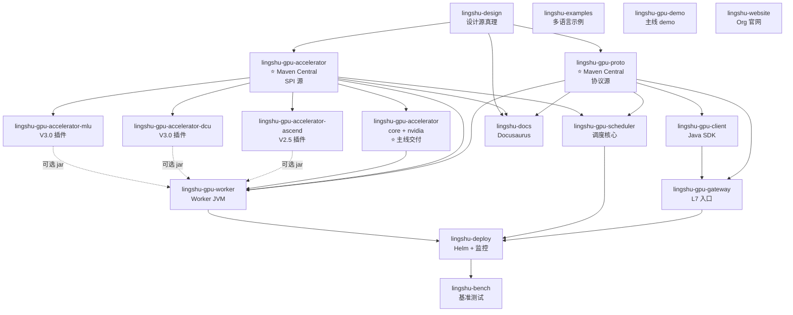

# lingshu-ai-infra Org Repository Structure

> 本文档定义 lingshu-ai-infra 组织下所有代码仓的内部目录结构、跨仓依赖关系、Release 节奏与 CI/CD 协调策略。
> 与 `linshu-ai-infra.md`(主设计文档)、`mvp-stories.md`(MVP Story 分解)并列,是组织级仓库真理源。
>
> **设计原则**:主线 NVIDIA 优先落地,国产算力(Ascend / DCU / MLU)通过插件化扩展,不阻塞主线进度。
> **判定标准**:任何让 Worker / Scheduler / Gateway 主线代码出现 `if (vendor == "ascend")` 字面量分支的,都是插件做的;
> 只在 Protobuf 数据模型加 `oneOf` 字段、Scheduler 过滤逻辑加 vendor 谓词的,才是主线做的。

---

## 1. Repo 地图

lingshu-ai-infra 组织下共 **16 个 repo**:12 现有 + 4 新增(加速器插件 + 主线 SPI 仓)。

| Repo | 类型 | 主线/插件 | 角色 | 技术栈 | 首次出现版本 |
|---|---|---|---|---|---|
| `lingshu-design` | 设计 | 主线 | 设计文档 + RFC + ADR | Markdown / Mermaid | V2.1 |
| `lingshu-website` | 文档 | 主线 | 组织官网 | HTML + CSS + JS(无框架)| V2.1 |
| `lingshu-docs` | 文档 | 主线 | 用户文档站点 | Node.js + Docusaurus 3 | V2.1 |
| **`lingshu-gpu-proto`** | 协议 | 主线 | **所有 RPC 协议源** | Protobuf + buf | V2.1 |
| `lingshu-gpu-client` | SDK | 主线 | Java 任务提交 SDK | Java 11 + gRPC | V2.1 |
| `lingshu-gpu-gateway` | 服务 | 主线 | L7 入口 + 鉴权 + 限流 | Java 17 + Spring Boot 3 | V2.1 |
| `lingshu-gpu-scheduler` | 服务 | 主线 | 调度核心(V2.5+ 无状态池)| Java 17 + Spring Boot 3 | V2.1 |
| `lingshu-gpu-worker` | 服务 | 主线 | Worker JVM 进程 | Java 17 + Spring Boot 3 | V2.1 |
| `lingshu-gpu-demo` | 示例 | 主线 | Demo Ops + 端到端测试 | Python + Java | V2.1 |
| `lingshu-deploy` | 部署 | 主线 | Helm + ArgoCD + 监控 | K8s + Helm + Prometheus | V2.1 |
| `lingshu-bench` | 工具 | 主线 | 性能基准 + 对比测试 | Locust + k6 + PromQL | V2.1 |
| `lingshu-examples` | 示例 | 主线 | 多语言客户端 + Op 模板 | Python / Go / Node.js / Rust | V2.1 |
| **`lingshu-gpu-accelerator`** | SPI | 主线 | **加速器抽象 SPI + NVIDIA 实现** | Java 17 + Maven 多模块 | V2.1 |
| `lingshu-gpu-accelerator-ascend` | 插件 | V2.5 后 | 华为昇腾 plugin | Java + CANN | V2.5 |
| `lingshu-gpu-accelerator-dcu` | 插件 | V3.0 后 | 海光 DCU plugin | Java + ROCm | V3.0 |
| `lingshu-gpu-accelerator-mlu` | 插件 | V3.0 后 | 寒武纪 MLU plugin | Java + CNRT | V3.0 |

> **加粗的 2 个 repo 是协议 / SPI 唯一源**,所有下游 Java 服务强制依赖,SEMVER 严格管控。

---

## 2. 主线核心服务 — 统一 Java/Spring Boot 模板

5 个 Java 服务 (`lingshu-gpu-proto` / `lingshu-gpu-client` / `lingshu-gpu-gateway` / `lingshu-gpu-scheduler` / `lingshu-gpu-worker`) 共享同一套骨架,内部包名按职责切分。

### 2.1 `lingshu-gpu-proto/` — 协议源(无业务逻辑)

```
lingshu-gpu-proto/
├── .github/
│   ├── workflows/
│   │   ├── ci.yml                        # buf lint + 生成 Java/Python/Go stubs
│   │   └── release.yml                   # tag → Maven Central
│   └── CODEOWNERS                        # @lingshu-ai-infra/proto-maintainers
├── proto/
│   ├── buf.yaml                          # buf workspace 配置
│   ├── buf.gen.yaml                      # 生成 Java + Python + Go stubs
│   ├── gpu_common.proto                  # 通用 enum: vendor / runtime / topology_kind / isolation_mode
│   ├── gpu_worker_config.proto           # §12.6.1 WorkerConfig + AcceleratorDevice
│   ├── gpu_task.proto                    # SubmitTaskRequest / InferenceRequest / InferenceResponse
│   ├── gpu_health.proto                  # Heartbeat / HealthCheck / HealthStatus
│   ├── gpu_federation.proto              # §12.7.4 ClusterRegistry / RoutePolicy
│   └── README.md                         # 协议变更流程: 修改 → buf breaking check → PR → Maven release
├── CHANGELOG.md                          # 严格 SemVer,breaking change 必须 major bump
└── LICENSE                               # Apache-2.0
```

**发布物**:Maven artifact `com.lingshu.gpu:lingshu-gpu-proto:1.x.x`,所有下游 Java 服务的唯一协议源。

### 2.2 `lingshu-gpu-client/` — Java SDK

```
lingshu-gpu-client/
├── .github/workflows/{ci.yml,release.yml}
├── src/main/java/com/lingshu/gpu/client/
│   ├── LingshuGpuClient.java             # 主入口,Builder 模式
│   ├── LingshuGpuClientBuilder.java
│   ├── config/
│   │   ├── ClientConfig.java
│   │   └── RetryPolicy.java
│   ├── retry/
│   │   ├── ExponentialBackoff.java
│   │   └── Jitter.java
│   ├── routing/                          # 客户端路由(直连 vs 走 Gateway)
│   │   ├── ClientSideRouter.java
│   │   └── AffinityKey.java
│   ├── stream/                           # LLM 流式调用
│   │   ├── StreamingInference.java
│   │   └── StreamObserver.java
│   └── observability/
│       ├── ClientMetrics.java
│       └── Tracing.java
├── src/main/resources/META-INF/
├── src/test/{java,resources}/
├── examples/
│   ├── BasicSubmitExample.java
│   ├── StreamingLlmExample.java
│   └── FailoverExample.java
├── pom.xml                               # 依赖: lingshu-gpu-proto
└── README.md + CHANGELOG.md
```

### 2.3 `lingshu-gpu-gateway/` — L7 入口

```
lingshu-gpu-gateway/
├── .github/workflows/{ci.yml,release.yml}
├── src/main/java/com/lingshu/gpu/gateway/
│   ├── GatewayApplication.java           # Spring Boot main
│   ├── controller/
│   │   ├── TaskController.java           # gRPC + REST 双协议入口
│   │   ├── AdminController.java          # /admin/worker/{id} 类管理接口
│   │   └── HealthController.java         # K8s liveness/readiness probe
│   ├── auth/
│   │   ├── RateLimiter.java              # 令牌桶,按 tenant 限流
│   │   ├── TokenAuthFilter.java
│   │   └── RbacFilter.java
│   ├── routing/                          # V2.5+: 一致性哈希路由到 Scheduler Pool
│   │   ├── ConsistentHashRouter.java
│   │   └── HealthAwareRouter.java        # 跳过 unhealthy 副本
│   ├── failover/
│   │   ├── SchedulerFailover.java
│   │   └── TaskRetryQueue.java
│   └── observability/
│       ├── PrometheusMetrics.java
│       └── OpenTelemetryTracing.java
├── src/main/resources/
│   ├── application.yml
│   ├── application-{dev,prod}.yml
│   └── logback-spring.xml
├── deploy/
│   ├── Dockerfile                        # base: eclipse-temurin:17-jre
│   └── helm/{Chart.yaml,values.yaml,templates/}
├── pom.xml                               # 依赖: lingshu-gpu-proto, lingshu-gpu-client
└── README.md + CHANGELOG.md
```

### 2.4 `lingshu-gpu-scheduler/` — 调度核心(主线最复杂的)

```
lingshu-gpu-scheduler/
├── .github/workflows/{ci.yml,release.yml}
├── src/main/java/com/lingshu/gpu/scheduler/
│   ├── SchedulerApplication.java
│   ├── api/                              # gRPC server 实现
│   │   ├── OpRegisterService.java
│   │   ├── SubmitTaskService.java
│   │   └── HeartbeatService.java
│   ├── filter/                           # §12.6.3
│   │   ├── WorkerFilter.java             # HEALTHY 过滤
│   │   ├── OpFilter.java                 # op_id + version 匹配
│   │   ├── VendorFilter.java             # 国产化 vendor 谓词
│   │   └── IsOpCompatible.java           # 5+2 步校验(主代码)
│   ├── score/                            # §12.5 多维度打分
│   │   ├── ScoringStrategy.java
│   │   ├── LoadBalancer.java
│   │   ├── AffinityScorer.java           # 同节点亲和
│   │   └── TopologyScorer.java           # NVLink / HCCS 拓扑加分
│   ├── state/                            # V2.5+ 热/冷分层
│   │   ├── HotStateClient.java           # Redis Cluster(分片读)
│   │   ├── ColdStateRepository.java      # MyBatis-Plus
│   │   └── StateReconciler.java          # K8s 风格 reconcile loop
│   ├── worker/
│   │   ├── WorkerRegistry.java           # ConcurrentHashMap<worker_id, WorkerNode>
│   │   ├── WorkerConfigCache.java
│   │   └── HeartbeatHandler.java         # V2.5: 写 Redis 替代直接改内存
│   ├── federation/                       # V3.0+ Flavor A Master
│   │   ├── ClusterRegistry.java
│   │   ├── RoutePolicyEngine.java
│   │   └── RegionHealthMonitor.java
│   └── config/
├── src/main/resources/
│   ├── application.yml
│   ├── mapper/                           # MyBatis XML
│   │   ├── WorkerStatusMapper.xml
│   │   ├── TaskHistoryMapper.xml
│   │   └── FederationClusterMapper.xml
│   └── db/migration/                     # Flyway
│       ├── V1__gpu_worker_status.sql
│       ├── V2__task_history.sql
│       ├── V3__federation_cluster.sql
│       └── V4__route_policy.sql
├── test/
│   ├── unit/                             # JUnit 5 + Mockito
│   ├── integration/                      # testcontainers: Redis + MySQL + K8s
│   └── bench/                            # §12.5 算法 JMH benchmark
├── deploy/{Dockerfile,helm/}
├── pom.xml                               # 依赖: lingshu-gpu-proto, lingshu-gpu-accelerator:core
└── README.md + CHANGELOG.md
```

### 2.5 `lingshu-gpu-worker/` — Worker JVM 进程(主线第二复杂)

```
lingshu-gpu-worker/
├── .github/workflows/{ci.yml,release.yml}
├── src/main/java/com/lingshu/gpu/worker/
│   ├── WorkerApplication.java
│   ├── bootstrap/
│   │   ├── WorkerBootstrap.java          # 启动器,ServiceLoader.load(AcceleratorAdapter)
│   │   ├── ConfigLoader.java             # 解析 application.yml(§12.6.5 managed_devices 契约)
│   │   └── PluginDiscovery.java          # 扫 META-INF/services + classpath
│   ├── registry/
│   │   ├── OpRegistry.java               # §12.6.6 三种 runtime 统一注册
│   │   ├── OpLoader.java
│   │   └── OpCapabilityValidator.java    # §12.6.5 错误处理表
│   ├── runtime/                          # §12.6.6 / §12.6.7
│   │   ├── OpRuntime.java                # interface
│   │   ├── JavaOpRuntime.java            # JAVA runtime
│   │   ├── JepOpRuntime.java             # PYTHON_JEP runtime(MVP 默认)
│   │   └── SidecarOpRuntime.java         # PYTHON_SIDECAR runtime(V2.5+)
│   ├── sidecar/                          # §12.6.7 Sidecar 生命周期管理
│   │   ├── SidecarProcessManager.java    # ProcessBuilder 封装
│   │   ├── SidecarHealthChecker.java
│   │   ├── SidecarCrashRecovery.java     # 指数退避重启
│   │   └── UnixDomainSocketManager.java  # UDS 文件清理
│   ├── dispatcher/
│   │   ├── OpDispatcher.java
│   │   └── InferenceExecutor.java
│   ├── reporter/
│   │   ├── WorkerConfigReporter.java     # 启动期上报 WorkerConfig
│   │   └── HeartbeatReporter.java        # V2.5: 写 Redis(V2.1: 直写 MySQL)
│   ├── accelerator/
│   │   └── AdapterDispatcher.java        # 调用 vendor adapter
│   └── lifecycle/
│       └── GracefulShutdown.java         # SIGTERM → 优雅停 Sidecar
├── src/main/resources/
│   ├── application.yml                   # §2.2.4 MVP 配置示例
│   ├── application-llm.yml               # LLM 4 卡 TP-4 配置示例
│   ├── application-sidecar.yml           # §12.6.7 Sidecar 配置示例
│   └── META-INF/services/
│       └── com.lingshu.gpu.accelerator.spi.AcceleratorAdapter
│           # NVIDIA 主线必装;国产 plugin 装上后自动追加
├── deploy/
│   ├── Dockerfile                        # 多 stage: cuda base → 装 NVIDIA Container Toolkit → 应用
│   └── helm/{Chart.yaml,templates/}
│       ├── daemonset.yaml                # 每 GPU 机器一个 Pod
│       └── device-plugin-ref.yaml
├── examples/
│   ├── text-classification-op/           # 示例:JAVA + Jep 两版
│   ├── llm-sidecar-op/                   # §12.6.7 完整 Sidecar demo
│   └── multi-op-coexist/                 # §2.2.4 多 Op 共存示例
├── test/{unit,integration}/
├── pom.xml                               # 依赖: lingshu-gpu-proto, lingshu-gpu-accelerator:nvidia
└── README.md + CHANGELOG.md
```

---

## 3. 加速器 SPI 与插件

### 3.1 `lingshu-gpu-accelerator/` — 主线 SPI 仓(Maven 多模块)

```
lingshu-gpu-accelerator/
├── .github/workflows/{ci.yml,release.yml}
├── core/                                 # ⭐ 主线必交:接口契约
│   ├── pom.xml
│   └── src/main/java/com/lingshu/gpu/accelerator/spi/
│       ├── AcceleratorAdapter.java       # SPI 接口(7 个方法)
│       ├── AcceleratorDevice.java        # 中性化设备描述
│       ├── ComputeCapability.java        # oneOf 解析
│       ├── TopologyKind.java             # 中性化拓扑枚举
│       ├── IsolationMode.java
│       └── HealthStatus.java
├── nvidia/                               # ⭐ 主线必交:唯一参考实现
│   ├── pom.xml
│   └── src/main/java/com/lingshu/gpu/accelerator/nvidia/
│       ├── NvidiaAdapter.java            # 调 NVML / nvidia-smi
│       ├── CudaComputeCap.java           # {major, minor}
│       └── NvmlWrapper.java              # JNA 封装 libnvidia-ml.so
├── ascend/                               # 空壳,V2.5 后由华为 ISV 填充
│   ├── pom.xml
│   └── README.md                         # 占位说明
├── dcu/                                  # 空壳,V3.0 后由海光生态填充
│   ├── pom.xml
│   └── README.md
├── mlu/                                  # 空壳,V3.0 后由寒武纪填充
│   ├── pom.xml
│   └── README.md
├── plugin-template/                      # 插件作者模板(主线交付)
│   ├── pom.xml
│   ├── README.md                         # 插件开发指南:两路径(内部贡献 vs 外部独立仓库)
│   └── src/main/java/com/lingshu/accelerator/template/
│       ├── TemplateAdapter.java          # 实现 AcceleratorAdapter 的骨架
│       └── pom.xml.template              # 模板 POM
├── pom.xml                               # parent POM,统一 Java 版本 + 依赖管理
├── README.md
└── CHANGELOG.md
```

### 3.2 国产 plugin 独立 repo 结构(以 Ascend 为例)

> `lingshu-gpu-accelerator-dcu` / `lingshu-gpu-accelerator-mlu` 结构相同,只换包名前缀和厂商 API。

```
lingshu-gpu-accelerator-ascend/          # V2.5 主线完成后独立创建
├── .github/workflows/{ci.yml,release.yml}
├── src/main/java/com/lingshu/ascend/
│   ├── AscendAdapter.java                # 实现 AcceleratorAdapter SPI
│   ├── AscendDevice.java                 # 调 ACL API
│   ├── AscendComputeCap.java             # {ai_cores, tops_int8, tops_fp16}
│   └── HccsTopologyProbe.java            # HCCS 拓扑探测
├── src/main/resources/META-INF/services/
│   └── com.lingshu.gpu.accelerator.spi.AcceleratorAdapter
│       └── 内容: com.lingshu.ascend.AscendAdapter
├── src/test/{unit,integration/}          # 真实昇腾硬件测试
├── docs/
│   ├── ascend-prerequisites.md           # CANN toolkit / Driver / firmware 安装指南
│   ├── ascend-op-development.md          # 用 aclGraph / MindSpore 写 Op
│   └── ascend-image-base.md              # 推荐容器基础镜像
├── pom.xml                               # 依赖: lingshu-gpu-accelerator:core(锁定版本)
├── README.md + CHANGELOG.md
└── LICENSE                               # Huawei 内部协议或 Apache-2.0
```

> **关键约束**:plugin 只能依赖 `lingshu-gpu-accelerator:core` SPI,**不能依赖任何主线业务模块**(scheduler / worker / gateway / proto),
> 保证插件作者不被主线代码改动阻塞,版本节奏完全独立。

---

## 4. 部署 / 工具链 / 示例 / 文档

### 4.1 `lingshu-deploy/` — K8s + 监控

```
lingshu-deploy/
├── .github/workflows/{helm-lint.yml,argocd-sync.yml}
├── helm/
│   ├── lingshu-gpu-gateway/              # 每个服务一个 chart
│   ├── lingshu-gpu-scheduler/            # V2.5+: HPA 2~10 副本
│   ├── lingshu-gpu-worker/               # DaemonSet,每 GPU 机器 1 Pod
│   ├── lingshu-redis/                    # V2.5+: Redis Cluster 6 节点
│   └── lingshu-mysql/                    # MySQL 主从(后续可拆云 RDS)
├── observability/
│   ├── prometheus/
│   │   ├── alerts.yml                    # Worker 心跳丢失 > 90s / Scheduler P99 > 500ms / Redis 节点 down
│   │   └── rules/
│   ├── grafana/dashboards/
│   │   ├── scheduler-overview.json
│   │   ├── worker-gpu-util.json
│   │   ├── sidecar-lifecycle.json        # §12.6.7 Sidecar 监控
│   │   └── federation-status.json        # V3.0+ Federation 监控
│   └── loki/                             # 日志聚合(可选)
├── device-plugins/
│   ├── nvidia-device-plugin.yaml
│   ├── ascend-device-plugin.yaml         # V2.5 后
│   └── dcu-device-plugin.yaml            # V3.0 后
├── argocd/applications/                  # GitOps 应用清单
├── README.md
└── CHANGELOG.md
```

### 4.2 `lingshu-bench/` — 基准测试

```
lingshu-bench/
├── .github/workflows/ci.yml
├── tools/
│   ├── locust/                           # 任务派发负载
│   ├── prometheus-query/                 # 性能数据自动汇总
│   └── flamegraph/                       # CPU profiling
├── scenarios/
│   ├── small-cluster/                    # 30 GPU 压测脚本
│   ├── medium-cluster/                   # 300 GPU 压测脚本
│   ├── failover/                         # 故障切换演练
│   └── scale-up/                         # 弹性扩缩演练
├── baselines/{v2.1-baseline.md,v2.5-baseline.md}
├── comparisons/{vs-mesos.md,vs-k8s-default-scheduler.md}
├── reports/
├── README.md
└── CHANGELOG.md
```

### 4.3 `lingshu-gpu-demo/` + `lingshu-examples/`

```
lingshu-gpu-demo/                          # 主线自带 demo
├── ops/
│   ├── text_classification/               # BERT-base(JAVA + Jep 双实现)
│   ├── text_embedding/                    # BGE-small
│   ├── llm_qwen70b/                       # §12.6.7 Sidecar 完整 demo
│   └── custom_resnet/                     # 自定义 CUDA kernel 示例
├── tests/{e2e/,performance/}
├── docker-compose.yml                     # 本地一站式启动 demo
├── scripts/{submit_demo_task.sh,watch_heartbeat.sh}
├── README.md
└── CHANGELOG.md

lingshu-examples/                          # 跨语言 + 教程
├── python/{basic_submit.py,streaming_llm.py,async_batch.py}
├── go/                                    # Go 客户端
├── nodejs/                                # Node.js 客户端
├── rust/                                  # Rust 客户端
├── op-templates/
│   ├── java-op-template/
│   ├── python-jep-op-template/
│   └── python-sidecar-op-template/        # §12.6.7 Sidecar 模板
├── notebooks/                             # Jupyter 教程
│   ├── 01-hello-gpu.ipynb
│   ├── 02-llm-streaming.ipynb
│   └── 03-multi-gpu-tp.ipynb
├── README.md
└── CHANGELOG.md
```

### 4.4 `lingshu-docs/` — Docusaurus 文档站点

```
lingshu-docs/
├── .github/workflows/{ci.yml,deploy.yml}  # build + GitHub Pages deploy
├── docs/
│   ├── intro.md
│   ├── architecture/
│   │   ├── overview.md                    # §12.3 架构图
│   │   ├── worker-config.md               # §12.6 WorkerConfig 详解
│   │   ├── federation.md                  # §12.7.4 Federation 详解
│   │   └── accelerators.md                # §12.8 多加速器插件化
│   ├── ops/{python-jep.md,python-sidecar.md,java.md}
│   ├── deployment/{k8s.md,docker-compose.md}
│   ├── operations/{monitoring.md,troubleshooting.md}
│   └── api/{proto-reference.md,rest-api.md}
├── blog/{2026-09-v2.1-mvp.md,...}
├── src/{components/,css/,pages/}
├── static/img/
├── docusaurus.config.js
├── sidebars.js
├── package.json
├── README.md
└── CHANGELOG.md
```

### 4.5 `lingshu-design/` — 设计文档仓

```
lingshu-design/
├── .github/workflows/{markdown-lint.yml,cdn-cache-check.yml}
├── docs/                                  # 注:本仓历史文档存根目录,本文件落地后保持 flat
├── linshu-ai-infra.md                     # 主设计文档(当前 ~100KB)
├── mvp-stories.md                         # MVP 14-story 分解
├── repo-structure.md                      # ⭐ 本文件:repo 内部结构
├── rfc/
│   ├── 0001-status-sharding.md            # §12.7.2 RFC 原文
│   ├── 0002-federation.md                 # §12.7.4 RFC 原文
│   ├── 0003-plugin-arch.md                # §12.8 RFC 原文
│   └── template.md
├── decisions/                             # ADR(架构决策记录)
│   ├── 0001-controller-manager-recon.md   # §13 Q4 决策依据
│   ├── 0002-redis-hot-state.md            # §13 Q11 决策依据
│   └── 0003-plugin-arch.md                # §13 Q12 决策依据
├── images/                                # 架构图原始文件(draw.io / mermaid)
├── README.md                              # 目录索引
└── CONTRIBUTING.md                        # 设计文档贡献流程
```

### 4.6 `lingshu-website/`

`lingshu-ai-infra` 组织官网,纯 HTML + CSS + JS(无框架),首轮已落地,目录结构详见该仓 `README.md`。

---

## 5. 跨 Repo 依赖图



**关键约束**:
1. **`lingshu-gpu-proto` 是协议唯一源** — Scheduler / Gateway / Worker / Client / Federation 全依赖它,proto 改动 → Maven major bump
2. **`lingshu-gpu-accelerator:core` 是 SPI 唯一源** — 主线 5 服务 + 所有插件都依赖它,SEMVER 严格管控
3. **插件独立 repo,只依赖 `core`** — 不依赖任何主线业务模块,**保证插件作者不被主线代码改动阻塞**
4. **`lingshu-deploy` Helm chart 是部署源真理** — 任何环境配置改动走 PR review,GitOps 自动同步

---

## 6. Release & CI/CD 协调策略

### 6.1 Release 物对照表

| Repo | Release 触发 | 发布物 | 与其他 repo 协调 |
|---|---|---|---|
| `lingshu-gpu-proto` | tag `v*` | Maven Central `lingshu-gpu-proto:VERSION` | breaking change → 通知所有下游 repo 升级 |
| `lingshu-gpu-accelerator:core` | tag `core-v*` | Maven Central `lingshu-gpu-accelerator-core:VERSION` | SPI 改动 → 主线 5 服务 + 所有插件升级 |
| `lingshu-gpu-accelerator:nvidia` | tag `nvidia-v*` | Maven Central `lingshu-gpu-accelerator-nvidia:VERSION` | 跟随 core 升级,版本独立 |
| `lingshu-gpu-{client,gateway,scheduler,worker}` | tag `v*` | Docker image + Helm chart | 内部测试矩阵确保兼容 |
| `lingshu-gpu-accelerator-{ascend,dcu,mlu}` | 各 vendor 团队自主 | 私有 Maven repo | **不阻塞主线发布** |
| `lingshu-design` / `lingshu-docs` / `lingshu-website` | merge to main | GitHub Pages 自动部署 | 文档源与代码 release 解耦 |

### 6.2 主线 CI 矩阵

```yaml
# lingshu-gpu-scheduler/.github/workflows/ci.yml 示例
strategy:
  matrix:
    accelerator: [nvidia]   # 主线只测 NVIDIA;国产 plugin 在各自 repo 测
steps:
  - run: mvn test -Paccelerator=${{ matrix.accelerator }}
```

### 6.3 集成 CI(可选触发,在 `lingshu-deploy`)

```yaml
strategy:
  matrix:
    accelerator: [nvidia, ascend, dcu, mlu]   # 完整集成 matrix,可选触发
```

### 6.4 主线 CI 矩阵

```yaml
# lingshu-gpu-scheduler/.github/workflows/ci.yml 示例
strategy:
  matrix:
    accelerator: [nvidia]   # 主线只测 NVIDIA;国产 plugin 在各自 repo 测
steps:
  - run: mvn test -Paccelerator=${{ matrix.accelerator }}
```

### 6.5 集成 CI(可选触发,在 `lingshu-deploy`)

```yaml
strategy:
  matrix:
    accelerator: [nvidia, ascend, dcu, mlu]   # 完整集成 matrix,可选触发
```

---

## 7. 仓库生命周期 Checklist

### 7.1 新建 Repo Checklist

- [ ] 在 `lingshu-ai-infra` org 下创建空仓
- [ ] 添加 README + LICENSE + CONTRIBUTING + CODEOWNERS
- [ ] 添加 `.github/workflows/ci.yml`(主线服务跑 NVIDIA 测试矩阵)
- [ ] 添加 `.github/ISSUE_TEMPLATE/{bug,feature}.md`
- [ ] 在 `lingshu-design/repo-structure.md` 本文件追加新 repo 行
- [ ] 在 lingshu-ai-infra org profile README 同步索引
- [ ] 在 `lingshu-docs` 站点索引加入链接

### 7.2 废弃 Repo Checklist

- [ ] 在 README 顶部加 `[DEPRECATED]` 横幅 + 替代 repo 链接
- [ ] 关闭 issue / PR(加 "moved to X" 评论)
- [ ] tag 一个 final release
- [ ] 30 天后归档(archive,非删除)
- [ ] 在 `repo-structure.md` 移到 "归档" 区块

### 7.3 主线代码改动红线

任何 PR 若修改了以下任一主线模块,核心 reviewer 必须看到 "主线改动合理性论证":

- `lingshu-gpu-proto/proto/`(协议字段增减)
- `lingshu-gpu-scheduler/src/main/java/.../filter/`(调度过滤逻辑)
- `lingshu-gpu-worker/src/main/java/.../runtime/`(Op runtime)
- `lingshu-gpu-accelerator/core/`(SPI 接口)
- `lingshu-gpu-accelerator/nvidia/`(NVIDIA 参考实现)

**否则拒 PR**。插件方 PR 仅限修改对应 vendor 子目录,不允许改主线模块。

### 7.4 "不阻塞主线"4 个具体保证

| 保证 | 实现方式 | 检验命令 |
|---|---|---|
| 1. 主线 CI 跑通 NVIDIA 即可 | Maven 只引入 `nvidia` 模块依赖 | `mvn test` 在 NVIDIA 单环境通过 |
| 2. 主线代码零 vendor 字符串 | 除 `"any"` 外,代码不出现 "ascend"/"mlu"/"dcu" 字面量 | `grep -rE "ascend\|mlu\|dcu\|moorethreads" src/main/java/` 返回 0 行 |
| 3. 新加 vendor 不需要改主线 | 插件 PR 只改 `lingshu-gpu-accelerator/{vendor}/` 目录 | 插件 PR diff 不触及主线模块 |
| 4. Protobuf 字段已 vendor-neutral | `AcceleratorDevice.compute_cap` 用 oneOf | proto 文件不出现 NVLink 字面量 |

---

## 8. 引用指引

- **主设计文档**:`linshu-ai-infra.md` — 架构定义、协议规范、决策记录(§1-§13)
- **MVP 分解**:`mvp-stories.md` — 14 个 Story + AC + 验收标准
- **本文件**:`repo-structure.md` — repo 内部结构、依赖关系、Release 策略
- **RFC / ADR**:`lingshu-design/rfc/` 与 `lingshu-design/decisions/` — 重大决策原文与依据

每个 repo 的 README 顶部应引用本文件:
> 本仓库结构定义见 [lingshu-design/repo-structure.md](https://github.com/lingshu-ai-infra/lingshu-design/blob/main/repo-structure.md)

---

**变更管理**:本文件的修改需走 RFC 流程(参见 `rfc/template.md`),任何新增/废弃/拆分 repo 都必须在本文件留痕。